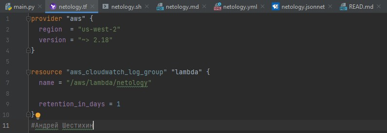

#  Задание №1 - Подготовка рабочей среды
Вы пришли на новое место работы или приобрели новый компьютер. Первым делом надо настроить окружение для дальнейшей работы.

1. Установить Py Charm Community Edition: https://www.jetbrains.com/ru-ru/pycharm/download/ - это бесплатная версия IDE. Если у вас уже установлен любой другой продукт от JetBrains,то можно использовать его.
2. Установить плагины:
Terraform,
MarkDown,
Yaml/Ansible Support,
Jsonnet.
3. Склонировать текущий репозиторий или просто создать файлы для проверки плагинов:
netology.tf – терраформ,
netology.sh – bash,
netology.md – markdown,
netology.yaml – yaml,
netology.jsonnet – jsonnet.
4. Убедитесь, что работает подсветка синтаксиса, файлы должны выглядеть вот так:
   
- Terraform:
  

  

- Bash:

  

- Markdown:

  

- Yaml:

  

- Jsonnet:

  

1. Добавьте свое имя в каждый файл, сделайте снимок экран и загрузите его на любой сервис обмена картинками.
2. Ссылки на картинки укажите в личном кабинете как решение домашнего задания.

#  Задание №2 - Описание жизненного цикла задачи (разработки нового функционала)
Чтобы лучше понимать предназначение дальнейших инструментов, с которыми нам предстоит работать, давайте составим схему жизненного цикла задачи в идеальном для вас случае.

##  Описание истории
Представьте, что вы работаете в стартапе, который запустил интернет-магазин. Ваш интернет-магазин достаточно успешно развивался, и вот пришло время налаживать процессы: у вас стало больше конечных клиентов, менеджеров и разработчиков.Сейчас от клиентов вам приходят задачи, связанные с разработкой нового функционала. Задач много, и все они требуют выкладки на тестовые среды, одобрения тестировщика, проверки менеджером перед показом клиенту. В случае необходимости, вам будет необходим откат изменений.

##  Решение задачи
Вам необходимо описать процесс решения задачи в соответствии с жизненным циклом разработки программного обеспечения. Использование какого-либо конкретного метода разработки не обязательно. Для решения главное - прописать по пунктам шаги решения задачи (релизации в конечный результат) с участием менеджера, разработчика (или команды разработчиков), тестировщика (или команды тестировщиков) и себя как DevOps-инженера.

1. Приходящей задаче от клиента ставится статус поставлена. Менеджер, разработчик и тестировщик оценивают поставленную задачу:
   - если задача нуждается в пояснении или дополнении, то отправляется на доработку клиенту
   - если задача ясна, то принимается в работу и менеджер ставит сроки выполнения 
2. После выполнения задачи и прохождения тестов, задаче ставится статус выполнено и задача отправляется на проверку клиенту
    - если задача устраивает клиента, ставится статус принята
    - если задача не устраивает клиента, возвращается исполнителю на доработку

Менеджер отслеживает сроки выполнения задач и их актуальность. Devops-инженер должен подготовит среду для непрерывной интеграции, тестирования, развертывания, мониторинга и обратной связи для данной задачи.