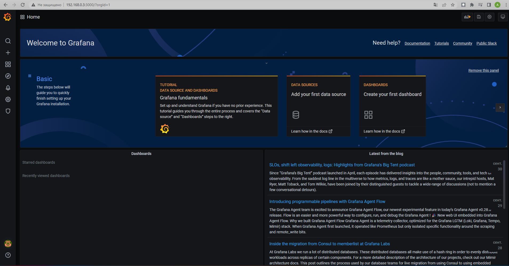
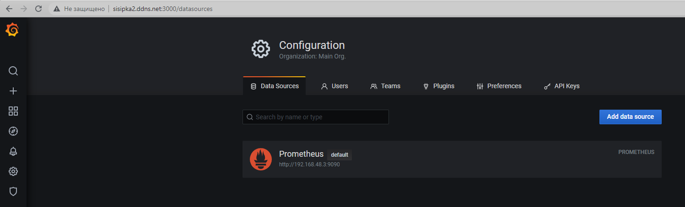
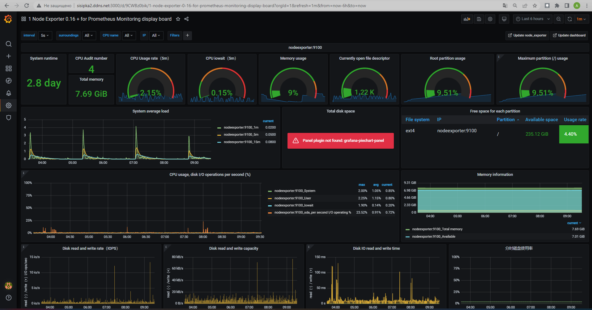
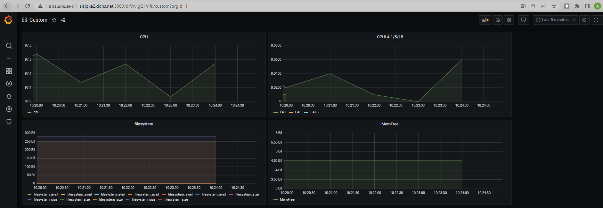
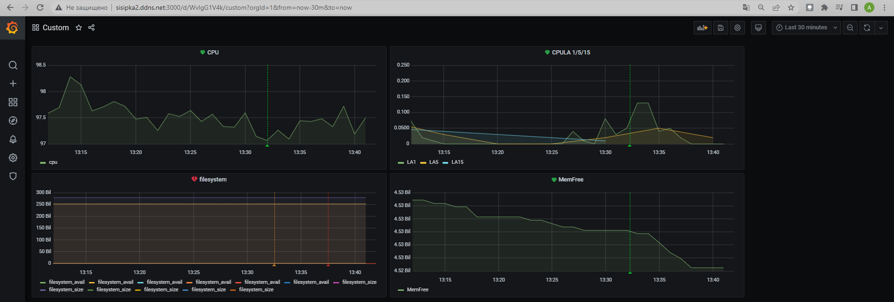

### Задание 1
Запустите связку prometheus-grafana.

```bash
lsd@nucub:~$ docker ps
CONTAINER ID   IMAGE                       COMMAND                  CREATED         STATUS         PORTS                                       NAMES
86736ad79f89   grafana/grafana:7.4.0       "/run.sh"                5 minutes ago   Up 5 minutes   0.0.0.0:3000->3000/tcp, :::3000->3000/tcp   grafana
d76bde9b79bf   prom/prometheus:v2.24.1     "/bin/prometheus --c…"   5 minutes ago   Up 5 minutes   9090/tcp                                    prometheus
d7945ad283a6   prom/node-exporter:v1.0.1   "/bin/node_exporter …"   5 minutes ago   Up 5 minutes   9100/tcp                                    nodeexporter
```

Зайдите в веб-интерфейс графана, используя авторизационные данные, указанные в манифесте docker-compose.

<p align="left">
  
</p>

Подключите поднятый вами prometheus как источник данных.

Решение домашнего задания - скриншот веб-интерфейса grafana со списком подключенных Datasource.

<p align="left">
  
</p>

<p align="left">
  
</p>

## Задание 2
Изучите самостоятельно ресурсы:
- [promql-for-humans](https://timber.io/blog/promql-for-humans/#cpu-usage-by-instance)
- [understanding prometheus cpu metrics](https://www.robustperception.io/understanding-machine-cpu-usage)

Создайте Dashboard и в ней создайте следующие Panels:
- Утилизация CPU для nodeexporter (в процентах, 100-idle)

```promql
(sum(increase(node_cpu_seconds_total{mode='idle'}[1m]))by(instance)) / (sum(increase(node_cpu_seconds_total[1m]))by(instance))  *100
```

- CPULA 1/5/15

```promql
node_load1
node_load5
node_load15

```

- Количество свободной оперативной памяти

```promql
node_memory_MemFree_bytes
```

- Количество места на файловой системе

```promql
node_filesystem_size_bytes
```

Для решения данного ДЗ приведите promql запросы для выдачи этих метрик, а также скриншот получившейся Dashboard.

<p align="left">
  
</p>

## Задание 3
Создайте для каждой Dashboard подходящее правило alert (можно обратиться к первой лекции в блоке "Мониторинг").

Для решения ДЗ - приведите скриншот вашей итоговой Dashboard.

<p align="left">
  
</p>


## Задание 4
Сохраните ваш Dashboard.

Для этого перейдите в настройки Dashboard, выберите в боковом меню "JSON MODEL".

Далее скопируйте отображаемое json-содержимое в отдельный файл и сохраните его.

В решении задания - приведите листинг этого файла.

[json model](https://github.com/sisipka/devops-netology/blob/main/Grafana/json%20model)