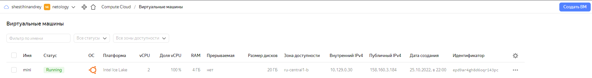

Вы DevOps инженер в крупной компании с большим парком сервисов. Ваша задача — разворачивать эти продукты в корпоративном кластере. 

## Задача 1: Установить Minikube

Для экспериментов и валидации ваших решений вам нужно подготовить тестовую среду для работы с Kubernetes. Оптимальное решение — развернуть на рабочей машине Minikube.

### Как поставить на AWS:
- создать EC2 виртуальную машину (Ubuntu Server 20.04 LTS (HVM), SSD Volume Type) с типом **t3.small**. Для работы потребуется настроить Security Group для доступа по ssh. Не забудьте указать keypair, он потребуется для подключения.
- подключитесь к серверу по ssh (ssh ubuntu@<ipv4_public_ip> -i <keypair>.pem)
- установите миникуб и докер следующими командами:
  - curl -LO https://storage.googleapis.com/kubernetes-release/release/`curl -s https://storage.googleapis.com/kubernetes-release/release/stable.txt`/bin/linux/amd64/kubectl
  - chmod +x ./kubectl
  - sudo mv ./kubectl /usr/local/bin/kubectl
  - sudo apt-get update && sudo apt-get install docker.io conntrack -y
  - curl -Lo minikube https://storage.googleapis.com/minikube/releases/latest/minikube-linux-amd64 && chmod +x minikube && sudo mv minikube /usr/local/bin/

<p align="left">
  
</p>

- проверить версию можно командой minikube version

```bash
lsd@mini:~$ minikube version
minikube version: v1.27.1
commit: fe869b5d4da11ba318eb84a3ac00f336411de7ba
```

- переключаемся на root и запускаем миникуб: minikube start --vm-driver=none

```bash
lsd@mini:~$ minikube start --driver=docker
😄  minikube v1.27.1 on Ubuntu 22.04 (vbox/amd64)
✨  Using the docker driver based on existing profile
👍  Starting control plane node minikube in cluster minikube
🚜  Pulling base image ...
🏃  Updating the running docker "minikube" container ...
🐳  Preparing Kubernetes v1.25.2 on Docker 20.10.18 ...
🔎  Verifying Kubernetes components...
    ▪ Using image gcr.io/k8s-minikube/storage-provisioner:v5
🌟  Enabled addons: default-storageclass, storage-provisioner
🏄  Done! kubectl is now configured to use "minikube" cluster and "default" namespace by default
```

- после запуска стоит проверить статус: minikube status

```bash
lsd@mini:~$ minikube status
minikube
type: Control Plane
host: Running
kubelet: Running
apiserver: Running
kubeconfig: Configured
```

- запущенные служебные компоненты можно увидеть командой: kubectl get pods --namespace=kube-system

```bash
lsd@mini:~$ kubectl get pods --namespace=kube-system
NAME                               READY   STATUS    RESTARTS      AGE
coredns-565d847f94-2g9pz           1/1     Running   1 (11m ago)   11m
etcd-minikube                      1/1     Running   2 (10m ago)   11m
kube-apiserver-minikube            1/1     Running   1 (10m ago)   11m
kube-controller-manager-minikube   1/1     Running   2 (10m ago)   11m
kube-proxy-fhhxr                   1/1     Running   2 (10m ago)   11m
kube-scheduler-minikube            1/1     Running   2 (10m ago)   11m
storage-provisioner                1/1     Running   0             10m
```

### Для сброса кластера стоит удалить кластер и создать заново:
- minikube delete
- minikube start --vm-driver=none

Возможно, для повторного запуска потребуется выполнить команду: sudo sysctl fs.protected_regular=0

Инструкция по установке Minikube - [ссылка](https://kubernetes.io/ru/docs/tasks/tools/install-minikube/)

**Важно**: t3.small не входит во free tier, следите за бюджетом аккаунта и удаляйте виртуалку.

## Задача 2: Запуск Hello World
После установки Minikube требуется его проверить. Для этого подойдет стандартное приложение hello world. А для доступа к нему потребуется ingress.

- развернуть через Minikube тестовое приложение по [туториалу](https://kubernetes.io/ru/docs/tutorials/hello-minikube/#%D1%81%D0%BE%D0%B7%D0%B4%D0%B0%D0%BD%D0%B8%D0%B5-%D0%BA%D0%BB%D0%B0%D1%81%D1%82%D0%B5%D1%80%D0%B0-minikube)

```bash
lsd@mini:~$ kubectl create deployment hello-node --image=k8s.gcr.io/echoserver:1.4
deployment.apps/hello-node created
lsd@mini:~$ kubectl get deployments
NAME         READY   UP-TO-DATE   AVAILABLE   AGE
hello-node   0/1     1            0           7s
lsd@mini:~$ kubectl get pods
NAME                         READY   STATUS    RESTARTS   AGE
hello-node-697897c86-qgxl7   1/1     Running   0          22s
lsd@mini:~$ kubectl expose deployment hello-node --type=LoadBalancer --port=8080
service/hello-node exposed
lsd@mini:~$ kubectl get services
NAME         TYPE           CLUSTER-IP    EXTERNAL-IP   PORT(S)          AGE
hello-node   LoadBalancer   10.100.20.1   <pending>     8080:31725/TCP   7s
kubernetes   ClusterIP      10.96.0.1     <none>        443/TCP          15m
lsd@mini:~$ minikube service hello-node
|-----------|------------|-------------|---------------------------|
| NAMESPACE |    NAME    | TARGET PORT |            URL            |
|-----------|------------|-------------|---------------------------|
| default   | hello-node |        8080 | http://192.168.49.2:31725 |
|-----------|------------|-------------|---------------------------|
🎉  Opening service default/hello-node in default browser...
👉  http://192.168.49.2:31725
lsd@mini:~$ curl http://192.168.49.2:31725
CLIENT VALUES:
client_address=172.17.0.1
command=GET
real path=/
query=nil
request_version=1.1
request_uri=http://192.168.49.2:8080/

SERVER VALUES:
server_version=nginx: 1.10.0 - lua: 10001

HEADERS RECEIVED:
accept=*/*
host=192.168.49.2:31725
user-agent=curl/7.81.0
BODY:
-no body in request-
```

- установить аддоны ingress и dashboard

```bash
lsd@mini:~$ minikube addons enable ingress
💡  ingress is an addon maintained by Kubernetes. For any concerns contact minikube on GitHub.
You can view the list of minikube maintainers at: https://github.com/kubernetes/minikube/blob/master/OWNERS
    ▪ Using image k8s.gcr.io/ingress-nginx/kube-webhook-certgen:v1.1.1
    ▪ Using image k8s.gcr.io/ingress-nginx/controller:v1.2.1
    ▪ Using image k8s.gcr.io/ingress-nginx/kube-webhook-certgen:v1.1.1
🔎  Verifying ingress addon...
🌟  The 'ingress' addon is enabled
lsd@mini:~$ minikube addons enable dashboard
💡  dashboard is an addon maintained by Kubernetes. For any concerns contact minikube on GitHub.
You can view the list of minikube maintainers at: https://github.com/kubernetes/minikube/blob/master/OWNERS
    ▪ Using image docker.io/kubernetesui/metrics-scraper:v1.0.8
    ▪ Using image docker.io/kubernetesui/dashboard:v2.7.0
💡  Some dashboard features require the metrics-server addon. To enable all features please run:

        minikube addons enable metrics-server
🌟  The 'dashboard' addon is enabled
```

```bash
lsd@mini:~$ minikube addons list
|-----------------------------|----------|--------------|--------------------------------|
|         ADDON NAME          | PROFILE  |    STATUS    |           MAINTAINER           |
|-----------------------------|----------|--------------|--------------------------------|
| ambassador                  | minikube | disabled     | 3rd party (Ambassador)         |
| auto-pause                  | minikube | disabled     | Google                         |
| csi-hostpath-driver         | minikube | disabled     | Kubernetes                     |
| dashboard                   | minikube | enabled ✅   | Kubernetes                     |
| default-storageclass        | minikube | enabled ✅   | Kubernetes                     |
| efk                         | minikube | disabled     | 3rd party (Elastic)            |
| freshpod                    | minikube | disabled     | Google                         |
| gcp-auth                    | minikube | disabled     | Google                         |
| gvisor                      | minikube | disabled     | Google                         |
| headlamp                    | minikube | disabled     | 3rd party (kinvolk.io)         |
| helm-tiller                 | minikube | disabled     | 3rd party (Helm)               |
| inaccel                     | minikube | disabled     | 3rd party (InAccel             |
|                             |          |              | [info@inaccel.com])            |
| ingress                     | minikube | enabled ✅   | Kubernetes                     |
| ingress-dns                 | minikube | disabled     | Google                         |
| istio                       | minikube | disabled     | 3rd party (Istio)              |
| istio-provisioner           | minikube | disabled     | 3rd party (Istio)              |
| kong                        | minikube | disabled     | 3rd party (Kong HQ)            |
| kubevirt                    | minikube | disabled     | 3rd party (KubeVirt)           |
| logviewer                   | minikube | disabled     | 3rd party (unknown)            |
| metallb                     | minikube | disabled     | 3rd party (MetalLB)            |
| metrics-server              | minikube | disabled     | Kubernetes                     |
| nvidia-driver-installer     | minikube | disabled     | Google                         |
| nvidia-gpu-device-plugin    | minikube | disabled     | 3rd party (Nvidia)             |
| olm                         | minikube | disabled     | 3rd party (Operator Framework) |
| pod-security-policy         | minikube | disabled     | 3rd party (unknown)            |
| portainer                   | minikube | disabled     | 3rd party (Portainer.io)       |
| registry                    | minikube | disabled     | Google                         |
| registry-aliases            | minikube | disabled     | 3rd party (unknown)            |
| registry-creds              | minikube | disabled     | 3rd party (UPMC Enterprises)   |
| storage-provisioner         | minikube | enabled ✅   | Google                         |
| storage-provisioner-gluster | minikube | disabled     | 3rd party (Gluster)            |
| volumesnapshots             | minikube | disabled     | Kubernetes                     |
|-----------------------------|----------|--------------|--------------------------------|
```


## Задача 3: Установить kubectl

Подготовить рабочую машину для управления корпоративным кластером. Установить клиентское приложение kubectl.
- подключиться к minikube 
- проверить работу приложения из задания 2, запустив port-forward до кластера

```bash
lsd@mini:~kubectl get pod,deploy,svc c 
NAME                             READY   STATUS    RESTARTS   AGE
pod/hello-node-697897c86-qgxl7   1/1     Running   0          144m

NAME                         READY   UP-TO-DATE   AVAILABLE   AGE
deployment.apps/hello-node   1/1     1            1           144m

NAME                 TYPE           CLUSTER-IP    EXTERNAL-IP   PORT(S)          AGE
service/hello-node   LoadBalancer   10.100.20.1   <pending>     8080:31725/TCP   143m
service/kubernetes   ClusterIP      10.96.0.1     <none>        443/TCP          159m
lsd@mini:~$ kubectl port-forward service/hello-node --address 0.0.0.0 3333:8080
Forwarding from 0.0.0.0:3333 -> 8080
Handling connection for 3333
E1026 19:45:58.795715  572725 portforward.go:391] error copying from local connection to remote stream: read tcp4 10.129.0.30:3333->92.101.221.205:47162: read: connection reset by peer
```