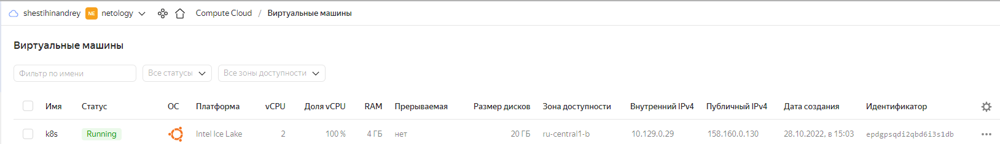

Кластер — это сложная система, с которой крайне редко работает один человек. Квалифицированный devops умеет наладить работу всей команды, занимающейся каким-либо сервисом.
После знакомства с кластером вас попросили выдать доступ нескольким разработчикам. Помимо этого требуется служебный аккаунт для просмотра логов.

## Задание 1: Запуск пода из образа в деплойменте
Для начала следует разобраться с прямым запуском приложений из консоли. Такой подход поможет быстро развернуть инструменты отладки в кластере. Требуется запустить деплоймент на основе образа из hello world уже через deployment. Сразу стоит запустить 2 копии приложения (replicas=2). 

<p align="left">
  
</p>

```bash
lsd@k8s:~$ microk8s status --wait-ready
microk8s is running
high-availability: no
  datastore master nodes: 127.0.0.1:19001
  datastore standby nodes: none
addons:
  enabled:
    dns                  # (core) CoreDNS
    ha-cluster           # (core) Configure high availability on the current node
    helm                 # (core) Helm - the package manager for Kubernetes
    helm3                # (core) Helm 3 - the package manager for Kubernetes
    ingress              # (core) Ingress controller for external access
  disabled:
    cert-manager         # (core) Cloud native certificate management
    community            # (core) The community addons repository
    dashboard            # (core) The Kubernetes dashboard
    gpu                  # (core) Automatic enablement of Nvidia CUDA
    host-access          # (core) Allow Pods connecting to Host services smoothly
    hostpath-storage     # (core) Storage class; allocates storage from host directory
    kube-ovn             # (core) An advanced network fabric for Kubernetes
    mayastor             # (core) OpenEBS MayaStor
    metallb              # (core) Loadbalancer for your Kubernetes cluster
    metrics-server       # (core) K8s Metrics Server for API access to service metrics
    observability        # (core) A lightweight observability stack for logs, traces and metrics
    prometheus           # (core) Prometheus operator for monitoring and logging
    rbac                 # (core) Role-Based Access Control for authorisation
    registry             # (core) Private image registry exposed on localhost:32000
    storage              # (core) Alias to hostpath-storage add-on, deprecated
```

```bash
lsd@k8s:~$ cat /var/snap/microk8s/current/credentials/kubelet.config
apiVersion: v1
clusters:
- cluster:
    certificate-authority-data: LS0tLS1CRUdJTiBDRVJUSUZJQ0FURS0tLS0tCk1JSUREekNDQWZlZ0F3SUJBZ0lVZFlmbkdMUUloTTJ3by9lVE5xYi8zb2VRdXNjd0RRWUpLb1pJaHZjTkFRRUwKQlFBd0Z6RVZNQk1HQTFVRUF3d01NVEF1TVRVeUxqRTRNeTR4TUI0WERUSXlNVEF5T0RFeU1EY3hNbG9YRFRNeQpNVEF5TlRFeU1EY3hNbG93RnpFVk1CTUdBMVVFQXd3TU1UQXVNVFV5TGpFNE15NHhNSUlCSWpBTkJna3Foa2lHCjl3MEJBUUVGQUFPQ0FROEFNSUlCQ2dLQ0FRRUFvL05ucUdEWmRaTXVkYnE0anhBaWpYYkF3VndHUFJHTC9ZUmgKcGZERVdoK2gyamRZL28wZzgzWTA5TGQza0tNWDliZC8wRktkQ1RyajhBY25jcStacjhMWGJnZGMrK3FMRm1BYQpkSUtEU1h6dGMwUUFncTBuTXZTcG82V3l1UzhDS0JBdWVwQzNzcmtrTko4QlFFTkRjMW5nQTFpamh0V3RrVjdICmp1ODBnT0lEZjdLdTdEL2VsOWRIWEp6R1RFRGRIWW9RNUZYL2tOakx0ZW5lWE15a3o1TCttMmhvZ3lLcnVSbjUKNkppdThRQVNqT0RsZUJpUWxPY0ZkeDYyUUVGNGpZNlExak1zU21vc2hUWEJlTTJPazVGaEtjaW9FQi9kYnBHaQpUVHdFVTFLR0NRdkJFK050VVN0Q0NoalNoUDdlZzhreGdMUERhSlRST2hJZFpRMVJnUUlEQVFBQm8xTXdVVEFkCkJnTlZIUTRFRmdRVW4yRGhzZ29oV0s3bkNrNUxuVDNyT1JQdjh6b3dId1lEVlIwakJCZ3dGb0FVbjJEaHNnb2gKV0s3bkNrNUxuVDNyT1JQdjh6b3dEd1lEVlIwVEFRSC9CQVV3QXdFQi96QU5CZ2txaGtpRzl3MEJBUXNGQUFPQwpBUUVBUjVlUFNUYjVNRTBrdUxiVm5IV2lwS213K3RwaXViRlJvd0IxV0prVDJhM3VXb01hdzhXcHZIR0dqYS8vCmJkWFh0VXg5djBpTFFOaVVZUFBzdzJzdXJiUEJHZkp1WjVTc1Qvb2dhajhncFloSit5ZkhLRW1UemVkb3g3YU0KdWx1Z0R1OUwxZk80Nzk0OG9rekd5emhwdXR2QVZ0TWFlVFZERmUxTFc4V2pWTnNTc3JIbG9ZWU1ONHRFSkMwVwpySlFvV2VwOEI2RmFacXVQb1Y0dC85Ti9OV2lYaDdXNnlETkhRc2ROTkNIMHJXUXh4WHN5MUpaZ3pucmJmaFg2ClpIZjJBb0FUUG5QVTRWcHY3eVBKcG1RMVBKU25LRzlIdUxmWHZYNmRFVjJ6eUFzT2R0VFRkRjhTRjhGYWhoc2MKbkhpbWZ6VUU2N2NDSmZSb3N1bFFiRy9Xenc9PQotLS0tLUVORCBDRVJUSUZJQ0FURS0tLS0tCg==
    server: https://127.0.0.1:16443
  name: microk8s-cluster
contexts:
- context:
    cluster: microk8s-cluster
    user: kubelet
  name: microk8s
current-context: microk8s
kind: Config
preferences: {}
users:
- name: kubelet
  user:
    token: NG1wNnFyRTNxdTZ4a1BCOU4xSm1XYUpsTVNyMXRLMVJ4N2VaS05pRDRSZz0K
```

```bash
lsd@k8s:~$ cat .kube/config 
apiVersion: v1
clusters:
- cluster:
    certificate-authority-data: LS0tLS1CRUdJTiBDRVJUSUZJQ0FURS0tLS0tCk1JSUREekNDQWZlZ0F3SUJBZ0lVZFlmbkdMUUloTTJ3by9lVE5xYi8zb2VRdXNjd0RRWUpLb1pJaHZjTkFRRUwKQlFBd0Z6RVZNQk1HQTFVRUF3d01NVEF1TVRVeUxqRTRNeTR4TUI0WERUSXlNVEF5T0RFeU1EY3hNbG9YRFRNeQpNVEF5TlRFeU1EY3hNbG93RnpFVk1CTUdBMVVFQXd3TU1UQXVNVFV5TGpFNE15NHhNSUlCSWpBTkJna3Foa2lHCjl3MEJBUUVGQUFPQ0FROEFNSUlCQ2dLQ0FRRUFvL05ucUdEWmRaTXVkYnE0anhBaWpYYkF3VndHUFJHTC9ZUmgKcGZERVdoK2gyamRZL28wZzgzWTA5TGQza0tNWDliZC8wRktkQ1RyajhBY25jcStacjhMWGJnZGMrK3FMRm1BYQpkSUtEU1h6dGMwUUFncTBuTXZTcG82V3l1UzhDS0JBdWVwQzNzcmtrTko4QlFFTkRjMW5nQTFpamh0V3RrVjdICmp1ODBnT0lEZjdLdTdEL2VsOWRIWEp6R1RFRGRIWW9RNUZYL2tOakx0ZW5lWE15a3o1TCttMmhvZ3lLcnVSbjUKNkppdThRQVNqT0RsZUJpUWxPY0ZkeDYyUUVGNGpZNlExak1zU21vc2hUWEJlTTJPazVGaEtjaW9FQi9kYnBHaQpUVHdFVTFLR0NRdkJFK050VVN0Q0NoalNoUDdlZzhreGdMUERhSlRST2hJZFpRMVJnUUlEQVFBQm8xTXdVVEFkCkJnTlZIUTRFRmdRVW4yRGhzZ29oV0s3bkNrNUxuVDNyT1JQdjh6b3dId1lEVlIwakJCZ3dGb0FVbjJEaHNnb2gKV0s3bkNrNUxuVDNyT1JQdjh6b3dEd1lEVlIwVEFRSC9CQVV3QXdFQi96QU5CZ2txaGtpRzl3MEJBUXNGQUFPQwpBUUVBUjVlUFNUYjVNRTBrdUxiVm5IV2lwS213K3RwaXViRlJvd0IxV0prVDJhM3VXb01hdzhXcHZIR0dqYS8vCmJkWFh0VXg5djBpTFFOaVVZUFBzdzJzdXJiUEJHZkp1WjVTc1Qvb2dhajhncFloSit5ZkhLRW1UemVkb3g3YU0KdWx1Z0R1OUwxZk80Nzk0OG9rekd5emhwdXR2QVZ0TWFlVFZERmUxTFc4V2pWTnNTc3JIbG9ZWU1ONHRFSkMwVwpySlFvV2VwOEI2RmFacXVQb1Y0dC85Ti9OV2lYaDdXNnlETkhRc2ROTkNIMHJXUXh4WHN5MUpaZ3pucmJmaFg2ClpIZjJBb0FUUG5QVTRWcHY3eVBKcG1RMVBKU25LRzlIdUxmWHZYNmRFVjJ6eUFzT2R0VFRkRjhTRjhGYWhoc2MKbkhpbWZ6VUU2N2NDSmZSb3N1bFFiRy9Xenc9PQotLS0tLUVORCBDRVJUSUZJQ0FURS0tLS0tCg==
    server: https://10.129.0.29:16443
  name: microk8s-cluster
contexts:
- context:
    cluster: microk8s-cluster
    user: admin
  name: microk8s
current-context: microk8s
kind: Config
preferences: {}
users:
- name: admin
  user:
    token: OEpBRG02V0xrWHpxcWtzU0w3UU5mWDBmRXlBVkR5enBxM1pJSVJwZll6OD0K
```

```bash
lsd@k8s:~$ microk8s kubectl get nodes
NAME   STATUS   ROLES    AGE   VERSION
k8s    Ready    <none>   61m   v1.25.3
lsd@k8s:~$ kubectl get nodes
NAME   STATUS   ROLES    AGE   VERSION
k8s    Ready    <none>   61m   v1.25.3
```

Подключение с другого ПК:

```bash
lsd@nucub:~$ cat .kube/config 
apiVersion: v1
clusters:
- cluster:
    certificate-authority-data: LS0tLS1CRUdJTiBDRVJUSUZJQ0FURS0tLS0tCk1JSUREekNDQWZlZ0F3SUJBZ0lVZFlmbkdMUUloTTJ3by9lVE5xYi8zb2VRdXNjd0RRWUpLb1pJaHZjTkFRRUwKQlFBd0Z6RVZNQk1HQTFVRUF3d01NVEF1TVRVeUxqRTRNeTR4TUI0WERUSXlNVEF5T0RFeU1EY3hNbG9YRFRNeQpNVEF5TlRFeU1EY3hNbG93RnpFVk1CTUdBMVVFQXd3TU1UQXVNVFV5TGpFNE15NHhNSUlCSWpBTkJna3Foa2lHCjl3MEJBUUVGQUFPQ0FROEFNSUlCQ2dLQ0FRRUFvL05ucUdEWmRaTXVkYnE0anhBaWpYYkF3VndHUFJHTC9ZUmgKcGZERVdoK2gyamRZL28wZzgzWTA5TGQza0tNWDliZC8wRktkQ1RyajhBY25jcStacjhMWGJnZGMrK3FMRm1BYQpkSUtEU1h6dGMwUUFncTBuTXZTcG82V3l1UzhDS0JBdWVwQzNzcmtrTko4QlFFTkRjMW5nQTFpamh0V3RrVjdICmp1ODBnT0lEZjdLdTdEL2VsOWRIWEp6R1RFRGRIWW9RNUZYL2tOakx0ZW5lWE15a3o1TCttMmhvZ3lLcnVSbjUKNkppdThRQVNqT0RsZUJpUWxPY0ZkeDYyUUVGNGpZNlExak1zU21vc2hUWEJlTTJPazVGaEtjaW9FQi9kYnBHaQpUVHdFVTFLR0NRdkJFK050VVN0Q0NoalNoUDdlZzhreGdMUERhSlRST2hJZFpRMVJnUUlEQVFBQm8xTXdVVEFkCkJnTlZIUTRFRmdRVW4yRGhzZ29oV0s3bkNrNUxuVDNyT1JQdjh6b3dId1lEVlIwakJCZ3dGb0FVbjJEaHNnb2gKV0s3bkNrNUxuVDNyT1JQdjh6b3dEd1lEVlIwVEFRSC9CQVV3QXdFQi96QU5CZ2txaGtpRzl3MEJBUXNGQUFPQwpBUUVBUjVlUFNUYjVNRTBrdUxiVm5IV2lwS213K3RwaXViRlJvd0IxV0prVDJhM3VXb01hdzhXcHZIR0dqYS8vCmJkWFh0VXg5djBpTFFOaVVZUFBzdzJzdXJiUEJHZkp1WjVTc1Qvb2dhajhncFloSit5ZkhLRW1UemVkb3g3YU0KdWx1Z0R1OUwxZk80Nzk0OG9rekd5emhwdXR2QVZ0TWFlVFZERmUxTFc4V2pWTnNTc3JIbG9ZWU1ONHRFSkMwVwpySlFvV2VwOEI2RmFacXVQb1Y0dC85Ti9OV2lYaDdXNnlETkhRc2ROTkNIMHJXUXh4WHN5MUpaZ3pucmJmaFg2ClpIZjJBb0FUUG5QVTRWcHY3eVBKcG1RMVBKU25LRzlIdUxmWHZYNmRFVjJ6eUFzT2R0VFRkRjhTRjhGYWhoc2MKbkhpbWZ6VUU2N2NDSmZSb3N1bFFiRy9Xenc9PQotLS0tLUVORCBDRVJUSUZJQ0FURS0tLS0tCg==
    server: https://158.160.0.130:16443
  name: microk8s-cluster
contexts:
- context:
    cluster: microk8s-cluster
    user: admin
  name: microk8s
current-context: microk8s
kind: Config
preferences: {}
users:
- name: admin
  user:
    token: OEpBRG02V0xrWHpxcWtzU0w3UU5mWDBmRXlBVkR5enBxM1pJSVJwZll6OD0K
```
```bash
lsd@nucub:~$ kubectl get nodes
NAME   STATUS   ROLES    AGE   VERSION
k8s    Ready    <none>   63m   v1.25.3
```

Требования:
 * пример из hello world запущен в качестве deployment

```bash
lsd@nucub:~$ kubectl create deployment --replicas=2 hello-node --image=k8s.gcr.io/echoserver:1.4
deployment.apps/hello-node created
```

 * количество реплик в deployment установлено в 2
 * наличие deployment можно проверить командой kubectl get deployment

```bash
lsd@nucub:~$ kubectl get deployment
NAME         READY   UP-TO-DATE   AVAILABLE   AGE
hello-node   2/2     2            2           11s
```

 * наличие подов можно проверить командой kubectl get pods

```bash
lsd@nucub:~$ kubectl get pods
NAME                         READY   STATUS    RESTARTS   AGE
hello-node-697897c86-fxv7w   1/1     Running   0          5s
hello-node-697897c86-qlrd8   1/1     Running   0          5s
```


## Задание 2: Просмотр логов для разработки
Разработчикам крайне важно получать обратную связь от штатно работающего приложения и, еще важнее, об ошибках в его работе. 
Требуется создать пользователя и выдать ему доступ на чтение конфигурации и логов подов в app-namespace.

Создайте пространство имен:
```bash
lsd@nucub:~$ kubectl create ns app-namespace
namespace/app-namespace created
lsd@nucub:~$ kubectl get namespace
NAME              STATUS   AGE
kube-system       Active   7h54m
kube-public       Active   7h54m
kube-node-lease   Active   7h54m
default           Active   7h54m
ingress           Active   7h53m
app-namespace     Active   3m26s
```
Требования: 
- создан новый токен доступа для пользователя

```bash
test@k8s:~$ openssl genrsa -out test.key 2048
test@k8s:~$ openssl req -new -key test.key -out test.csr -subj "/CN=test"
root@k8s:/home/test# openssl x509 -req -in test.csr -CA /var/snap/microk8s/4094/certs/ca.crt -CAkey /var/snap/microk8s/4094/certs/ca.key -CAcreateserial -out test.crt -days 500
```

- пользователь прописан в локальный конфиг (~/.kube/config, блок users)

```bash
test@k8s:~$ sudo kubectl config --kubeconfig=./config set-credentials test --client-key=test.key --client-certificate=test.crt --embed-certs=true
User "test" set.
test@k8s:~$ sudo kubectl config --kubeconfig=./config set-context default --cluster=k8s --user=test --namespace app-namespace
Context "default" created.
test@k8s:~$ sudo kubectl config --kubeconfig=./config use-context default
Switched to context "default".
test@k8s:~$ cat .kube/config 
apiVersion: v1
clusters:
- cluster:
    certificate-authority-data: LS0tLS1CRUdJTiBDRVJUSUZJQ0FURS0tLS0tCk1JSUREekNDQWZlZ0F3SUJBZ0lVZFlmbkdMUUloTTJ3by9lVE5xYi8zb2VRdXNjd0RRWUpLb1pJaHZjTkFRRUwKQlFBd0Z6RVZNQk1HQTFVRUF3d01NVEF1TVRVeUxqRTRNeTR4TUI0WERUSXlNVEF5T0RFeU1EY3hNbG9YRFRNeQpNVEF5TlRFeU1EY3hNbG93RnpFVk1CTUdBMVVFQXd3TU1UQXVNVFV5TGpFNE15NHhNSUlCSWpBTkJna3Foa2lHCjl3MEJBUUVGQUFPQ0FROEFNSUlCQ2dLQ0FRRUFvL05ucUdEWmRaTXVkYnE0anhBaWpYYkF3VndHUFJHTC9ZUmgKcGZERVdoK2gyamRZL28wZzgzWTA5TGQza0tNWDliZC8wRktkQ1RyajhBY25jcStacjhMWGJnZGMrK3FMRm1BYQpkSUtEU1h6dGMwUUFncTBuTXZTcG82V3l1UzhDS0JBdWVwQzNzcmtrTko4QlFFTkRjMW5nQTFpamh0V3RrVjdICmp1ODBnT0lEZjdLdTdEL2VsOWRIWEp6R1RFRGRIWW9RNUZYL2tOakx0ZW5lWE15a3o1TCttMmhvZ3lLcnVSbjUKNkppdThRQVNqT0RsZUJpUWxPY0ZkeDYyUUVGNGpZNlExak1zU21vc2hUWEJlTTJPazVGaEtjaW9FQi9kYnBHaQpUVHdFVTFLR0NRdkJFK050VVN0Q0NoalNoUDdlZzhreGdMUERhSlRST2hJZFpRMVJnUUlEQVFBQm8xTXdVVEFkCkJnTlZIUTRFRmdRVW4yRGhzZ29oV0s3bkNrNUxuVDNyT1JQdjh6b3dId1lEVlIwakJCZ3dGb0FVbjJEaHNnb2gKV0s3bkNrNUxuVDNyT1JQdjh6b3dEd1lEVlIwVEFRSC9CQVV3QXdFQi96QU5CZ2txaGtpRzl3MEJBUXNGQUFPQwpBUUVBUjVlUFNUYjVNRTBrdUxiVm5IV2lwS213K3RwaXViRlJvd0IxV0prVDJhM3VXb01hdzhXcHZIR0dqYS8vCmJkWFh0VXg5djBpTFFOaVVZUFBzdzJzdXJiUEJHZkp1WjVTc1Qvb2dhajhncFloSit5ZkhLRW1UemVkb3g3YU0KdWx1Z0R1OUwxZk80Nzk0OG9rekd5emhwdXR2QVZ0TWFlVFZERmUxTFc4V2pWTnNTc3JIbG9ZWU1ONHRFSkMwVwpySlFvV2VwOEI2RmFacXVQb1Y0dC85Ti9OV2lYaDdXNnlETkhRc2ROTkNIMHJXUXh4WHN5MUpaZ3pucmJmaFg2ClpIZjJBb0FUUG5QVTRWcHY3eVBKcG1RMVBKU25LRzlIdUxmWHZYNmRFVjJ6eUFzT2R0VFRkRjhTRjhGYWhoc2MKbkhpbWZ6VUU2N2NDSmZSb3N1bFFiRy9Xenc9PQotLS0tLUVORCBDRVJUSUZJQ0FURS0tLS0tCg==
    server: https://10.129.0.29:16443
  name: k8s
contexts:
- context:
    cluster: k8s
    namespace: app-namespace
    user: test
  name: default
current-context: default
kind: Config
preferences: {}
users:
- name: test
  user:
    client-certificate-data: LS0tLS1CRUdJTiBDRVJUSUZJQ0FURS0tLS0tCk1JSUNyVENDQVpVQ0ZFQVpSd3I4ZHNyUkROT0FtbVYzSDNlY2VqWlBNQTBHQ1NxR1NJYjNEUUVCQ3dVQU1CY3gKRlRBVEJnTlZCQU1NRERFd0xqRTFNaTR4T0RNdU1UQWVGdzB5TWpFd016RXlNREE1TURCYUZ3MHlOREF6TVRReQpNREE1TURCYU1BOHhEVEFMQmdOVkJBTU1CSFJsYzNRd2dnRWlNQTBHQ1NxR1NJYjNEUUVCQVFVQUE0SUJEd0F3CmdnRUtBb0lCQVFDT2V2eEd6Q2s4bEZnb3o0Y01JcW10M3Z6b1NNYkZNNXcxN2tzc3FxcGp6UjdiSjBjR0ZiUFQKMTZDaVBvNSs5dXFkMGZKVFpxMkt1ck15bHp5dlNoaUc4d09VQjhCc0h3Q2ZLUVRLdjdvSGVHMU5ybFhyMW9YQQo5UnBsV1IzSkR0WWtoS2Y4dFZMREtycC9wemhYTVZleThXWDFmOXZWc005dzZFTUNuVlNITno3M2lvK3hDZlArCnRLZHBGdExGV0t6elFNc0R4MmloMEx1RFd2WUFWbjQyZmUzblUyRzNUb0hrNkFGUG1lY0NRWjgwdTVUSGw3WXoKOStKODBGTWxDSFJ6REV3ZXJyTVRCcFZkYTdEYzZMSVJ5UHRoV0tNQTVKQlk0VU9XRjZCRFJKaGsvLzJ1V3RldgpFZmw4ZHFSYXFzcDI0dFIreThMK0dqbEU3SUZZWHd0UEFnTUJBQUV3RFFZSktvWklodmNOQVFFTEJRQURnZ0VCCkFJK3VRSTdLc2F2QTkyVGpTczV4UEM4Yyt0T2c3UENHTWc5M3FPalhQblkvb01obklYRVVENk1BcWxOaGhiNkEKR29SMnVCRXo2MGEvaHdTdWZVdk95YjFKTE50NzhTYWlGVG5ycWlmdGwwNkoxWk1lNVIzZjExYUdEOFNXbTlnVApraDhNSUdHaEpBQXp4bTk3UmticWVpZzhER0hLWTNmNk1ua1ZYaUFkdm5meHdITlRiOWsyRWZ4cG5TaUNTQ1hhClRHTlRZenBkMnVSblJIajZRVWxvZ1dra1Y5VEQveFQ2bmdUMVk1bG9xZmd2UlNLNUZkMVlQL3RhR2JVZGVlSlYKQzFFby9nZTJCVm44SXpLbWttYzlQV0dCRWxNVy9FM1ZsWTVPbEs5djRsMk9OdWI3TVc4alo5SllVUm5TSnQvbwo4M1JpVk5JVGtXUW0reWNxSnVTZ2N6Yz0KLS0tLS1FTkQgQ0VSVElGSUNBVEUtLS0tLQo=
    client-key-data: LS0tLS1CRUdJTiBQUklWQVRFIEtFWS0tLS0tCk1JSUV2QUlCQURBTkJna3Foa2lHOXcwQkFRRUZBQVNDQktZd2dnU2lBZ0VBQW9JQkFRQ09ldnhHekNrOGxGZ28KejRjTUlxbXQzdnpvU01iRk01dzE3a3NzcXFwanpSN2JKMGNHRmJQVDE2Q2lQbzUrOXVxZDBmSlRacTJLdXJNeQpsenl2U2hpRzh3T1VCOEJzSHdDZktRVEt2N29IZUcxTnJsWHIxb1hBOVJwbFdSM0pEdFlraEtmOHRWTERLcnAvCnB6aFhNVmV5OFdYMWY5dlZzTTl3NkVNQ25WU0hOejczaW8reENmUCt0S2RwRnRMRldLenpRTXNEeDJpaDBMdUQKV3ZZQVZuNDJmZTNuVTJHM1RvSGs2QUZQbWVjQ1FaODB1NVRIbDdZejkrSjgwRk1sQ0hSekRFd2Vyck1UQnBWZAphN0RjNkxJUnlQdGhXS01BNUpCWTRVT1dGNkJEUkpoay8vMnVXdGV2RWZsOGRxUmFxc3AyNHRSK3k4TCtHamxFCjdJRllYd3RQQWdNQkFBRUNnZ0VBRXR5dE1TSXVBMXNRSUxiNGhkN0EzOGU1YTNiVytaeFBmY1JDSjNPZ2d2M1EKcStxVE9IYi9DM2hzUjQ1SWh2NWhLT3QyVFJ3MnRUcnFKalJuVUQxYTZlS2FBcXJVQ254QU5OSFZWSkgxS3JBQwpxRm4vL2V5MFlFc1NaNEJZdFJsRnVDZm5wVWpMNEJKMEJobzVGekh0RGo5dTVBVTlNUmpySFdOaUc2S0FZalgzCml0VHNQQ0NLOGs5Yk9vZXBkNGtpYVUwa2dDVTBObjNWeHlOVitBaU5pS3MxT0YzSFJUSlJjbGowcnFCU1lXSXgKcmVnNWk0U1gvMjB6cVJQUEdYZTFOOHVGbTZRd0NsUUJJdXJCSVUxWGZUWHFvSFFkWU92RzJCZjVvdFRxemNsQgpvN1NMWlVZa3NGTWg3ODcyVHc4eUZ3TExkWFdOTzN5TDFnbzZ2czRUNFFLQmdRQy9kTFBYc001MnMxZWRkeTNJCkFMQTE2c21GNG1mWCtNZE9SZlhNVXBZemFENUtXeFhrSi9aSTNCQVdLK3c4VzNKd21ZQlRrazdnai9LL1BIK0oKR1NSL3k4eWN3OVhsejQ2TWUvQjFrSFRaa0h2a0p6T0FXdXZqMVVMLzVyNnRJVE1TYTNLcnNLc01LQ2NUVXBQdwpyZVZURVJJdXdIbzJaaW8zeDJHWUVWaXg3UUtCZ1FDK2c0aCttK0wvS0Z3TW1wcHZ0R2xobVM0S1VLYlh1S3lJCkh3ZUk4ZVZzcEs1cEJPU2docTZLVmRnUXJ5Z0gxNmZKN1RRd2RMaEVIUFpMRTdlVjEwa2t0SElvdGdkUVVTaWUKVlo5MjVvWERMMWxlektkRHlJVGxobDRmOVVNUkNEZ0VXbU0yRlQ4anZQcWwzc3RGSkdmMGp4a3BON3o5L0kvVgpnaFd3QVFLNnF3S0JnSG5zMERza0ZkZnlEbkh4Vys1cXdjMFVZSklxeFFiOUg2L3hUYjk1T0w0MFBMY05tcnRaCjE3WStydC92eU5vSFFySUNqMzZwUmlJc2llTFBuRWlyQWx1QVppWFBjWUNRMWE4Um51aS92aXB2b1BhRElJRTEKWmRRS0ZFanpvYXFQNGY1dy91M243SVlwYS9rYU5heW9rY3A4ckorcFpDc1FsUUpBcng0d3JkTmhBb0dBYzZJZQpYTXA5VXVYS1NSUWxuSnRpUXd6WWR3WlEzaXFHL2UvbmdPVmhuVG12YXFxL29mZGRSVFdwZVNiM0l4dHdDZzNoCldXL2V6K2pNVFBGZ3dwL3pFMFk2N0I3Zi9ZM2xHNFZZenJCSWpCblhJc1VRMlFHQ09GWUFGMkdrSFZoaHQ3S3MKK1F5WVVEYko0NWVBeFN5OXRDQ080d2VqdkgxcFIrdzNBYWI3WXhVQ2dZQnRoeis3dzNYdUQ2eW5jZXNaOGZMSwpNRlRiVHVESGJWeTZFS0tFOVJsclJ4S3NXTWJMblpPcWdleEFXT254MllMa082SmUvajZGN0VibmJzOG5GUzdMCm9DRWY3Wk1vVE5jR2VoQ2hFS0RvODk1bElHVCtQWldDeFNPWkp0RW01MUE0bWZjbklPN2p5cm5ka2RTbklXSW8KVVlmdjE5UWl2QkNsNHBBQk9iT0IrUT09Ci0tLS0tRU5EIFBSSVZBVEUgS0VZLS0tLS0K
    ```

- пользователь может просматривать логи подов и их конфигурацию (kubectl logs pod <pod_id>, kubectl describe pod <pod_id>)

```bash
test@k8s:~$ kubectl -n app-namespace get pods
NAME                         READY   STATUS    RESTARTS   AGE
hello-node-697897c86-t67f7   1/1     Running   0          10h
hello-node-697897c86-p5x4q   1/1     Running   0          10h
```
```bash
test@k8s:~$ kubectl -n app-namespace get role
NAME        CREATED AT
read-user   2022-10-31T08:43:22Z
```


## Задание 3: Изменение количества реплик 
Поработав с приложением, вы получили запрос на увеличение количества реплик приложения для нагрузки. Необходимо изменить запущенный deployment, увеличив количество реплик до 5. Посмотрите статус запущенных подов после увеличения реплик. 

Требования:
 * в deployment из задания 1 изменено количество реплик на 5
 * проверить что все поды перешли в статус running (kubectl get pods)

```bash
lsd@nucub:~$ kubectl scale deployment -n app-namespace hello-node --replicas=5
deployment.apps/hello-node scaled
lsd@nucub:~$ kubectl -n app-namespace get pod
NAME                         READY   STATUS    RESTARTS   AGE
hello-node-697897c86-t67f7   1/1     Running   0          11h
hello-node-697897c86-p5x4q   1/1     Running   0          11h
hello-node-697897c86-zlhmn   1/1     Running   0          12s
hello-node-697897c86-v4rhl   1/1     Running   0          12s
hello-node-697897c86-fhsbd   1/1     Running   0          12s
```