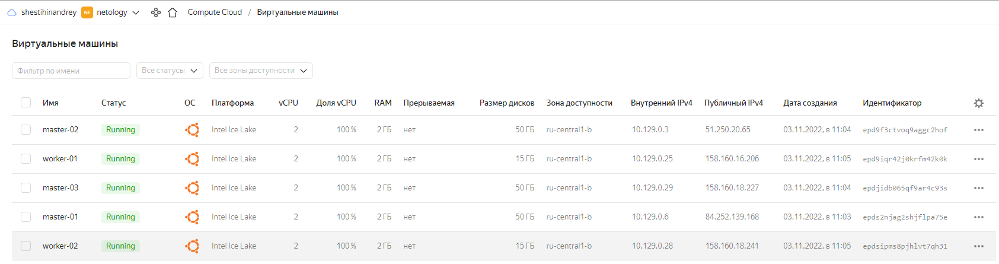

## Задание 1: Подготовить инвентарь kubespray
Новые тестовые кластеры требуют типичных простых настроек. Нужно подготовить инвентарь и проверить его работу. Требования к инвентарю:
* подготовка работы кластера из 5 нод: 3 мастер и 2 рабочие ноды;
* в качестве CRI — containerd;
* запуск etcd производить на мастере.

**inventory.ini**

```bash
lsd@nucub:~/kubespray/inventory/mycluster$ cat inventory.ini 
# ## Configure 'ip' variable to bind kubernetes services on a
# ## different ip than the default iface
# ## We should set etcd_member_name for etcd cluster. The node that is not a etcd member do not need to set the value, or can set the empty string value.
[all]
# node1 ansible_host=84.252.139.168  # ip=10.3.0.1 etcd_member_name=etcd1
# node2 ansible_host=51.250.20.65  # ip=10.3.0.2 etcd_member_name=etcd2
# node3 ansible_host=158.160.18.227  # ip=10.3.0.3 etcd_member_name=etcd3
# node4 ansible_host=158.160.16.206  # ip=10.3.0.4 etcd_member_name=etcd4
# node5 ansible_host=158.160.18.241  # ip=10.3.0.5 etcd_member_name=etcd5


# ## configure a bastion host if your nodes are not directly reachable
# [bastion]
# bastion ansible_host=x.x.x.x ansible_user=some_user

[kube_control_plane]
# node1
# node2
# node3

[etcd]
# node1
# node2
# node3

[kube_node]
# node4
# node5


[calico_rr]

[k8s_cluster:children]
kube_control_plane
kube_node
calico_rr
```

**hosts.yaml**

```bash
lsd@nucub:~/kubespray/inventory/mycluster$ cat hosts.yaml
all:
  hosts:
    node1:
      ansible_host: 84.252.139.168
      ansible_user: lsd
    node2:
      ansible_host: 51.250.20.65
      ansible_user: lsd
    node3:
      ansible_host: 158.160.18.227
      ansible_user: lsd
    node4:
      ansible_host: 158.160.16.206
      ansible_user: lsd
    node5:
      ansible_host: 158.160.18.241
      ansible_user: lsd
  children:
    kube_control_plane:
      hosts:
        node1:
        node2:
        node3:
    kube_node:
      hosts:
        node4:
        node5:
    etcd:
      hosts:
        node1:
        node2:
        node3:
    k8s_cluster:
      children:
        kube_control_plane:
        kube_node:
    calico_rr:
      hosts: {}
```


## Задание 2: подготовить и проверить инвентарь для кластера в cloud.yandex.ru
Часть новых проектов хотят запускать на мощностях cloud.yandex.ru. Требования похожи:
* разворачивать 5 нод: 3 мастер и 2 рабочие ноды;

<p align="left">
  
</p>

```bash
lsd@nucub:~$ yc compute instance list
+----------------------+-----------+---------------+---------+----------------+-------------+
|          ID          |   NAME    |    ZONE ID    | STATUS  |  EXTERNAL IP   | INTERNAL IP |
+----------------------+-----------+---------------+---------+----------------+-------------+
| epd9f3ctvoq9aggc2hof | master-02 | ru-central1-b | RUNNING | 51.250.20.65   | 10.129.0.3  |
| epd9iqr42j0krfm42k0k | worker-01 | ru-central1-b | RUNNING | 158.160.16.206 | 10.129.0.25 |
| epdjidb065qf9ar4c93s | master-03 | ru-central1-b | RUNNING | 158.160.18.227 | 10.129.0.29 |
| epds2njag2shjflpa75e | master-01 | ru-central1-b | RUNNING | 84.252.139.168 | 10.129.0.6  |
| epdsipms8pjhlvt7qh31 | worker-02 | ru-central1-b | RUNNING | 158.160.18.241 | 10.129.0.28 |
+----------------------+-----------+---------------+---------+----------------+-------------+
```

```bash
lsd@node1:~$ kubectl get nodes
NAME    STATUS   ROLES           AGE   VERSION
node1   Ready    control-plane   25m   v1.25.3
node2   Ready    control-plane   24m   v1.25.3
node3   Ready    control-plane   24m   v1.25.3
node4   Ready    <none>          21m   v1.25.3
node5   Ready    <none>          21m   v1.25.3
```