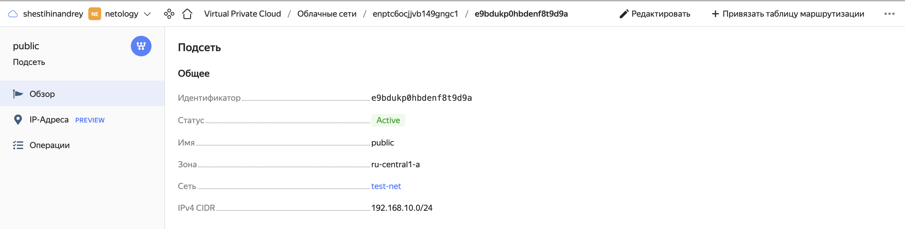
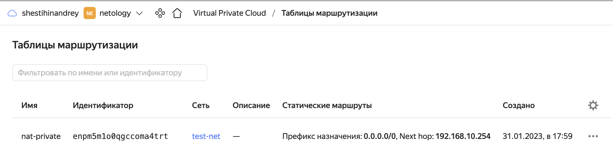
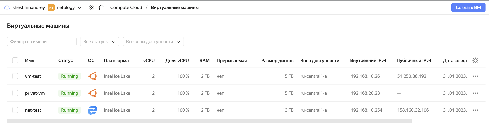

## Задание 1. Яндекс.Облако (обязательное к выполнению)

1. Создать VPC.
- Создать пустую VPC. Выбрать зону.
2. Публичная подсеть.
- Создать в vpc subnet с названием public, сетью 192.168.10.0/24.
- Создать в этой подсети NAT-инстанс, присвоив ему адрес 192.168.10.254. В качестве image_id использовать fd80mrhj8fl2oe87o4e1
- Создать в этой публичной подсети виртуалку с публичным IP и подключиться к ней, убедиться что есть доступ к интернету.
3. Приватная подсеть.
- Создать в vpc subnet с названием private, сетью 192.168.20.0/24.
- Создать route table. Добавить статический маршрут, направляющий весь исходящий трафик private сети в NAT-инстанс
- Создать в этой приватной подсети виртуалку с внутренним IP, подключиться к ней через виртуалку, созданную ранее и убедиться что есть доступ к интернету

Resource terraform для ЯО
- [VPC subnet](https://registry.terraform.io/providers/yandex-cloud/yandex/latest/docs/resources/vpc_subnet)
- [Route table](https://registry.terraform.io/providers/yandex-cloud/yandex/latest/docs/resources/vpc_route_table)
- [Compute Instance](https://registry.terraform.io/providers/yandex-cloud/yandex/latest/docs/resources/compute_instance)

<p align="left">
  
</p>

<p align="left">
  
</p>

<p align="left">
  
</p>

<p align="left">
  
</p>

```bash
andreyshestikhin@MacBook-Air-Andrey ~ % ssh lsd@51.250.86.192
Welcome to Ubuntu 22.04.1 LTS (GNU/Linux 5.15.0-58-generic x86_64)

  System information as of Tue Jan 31 04:38:33 PM UTC 2023

  System load:  0.06689453125      Processes:             130
  Usage of /:   28.0% of 14.68GB   Users logged in:       0
  Memory usage: 12%                IPv4 address for eth0: 192.168.10.26
  Swap usage:   0%

lsd@vm-test:~$ ssh lsd@192.168.20.23
Welcome to Ubuntu 22.04.1 LTS (GNU/Linux 5.15.0-58-generic x86_64)

 * Documentation:  https://help.ubuntu.com
 * Management:     https://landscape.canonical.com
 * Support:        https://ubuntu.com/advantage

  System information as of Tue Jan 31 04:39:08 PM UTC 2023

  System load:  0.0                Processes:             132
  Usage of /:   28.0% of 14.68GB   Users logged in:       0
  Memory usage: 14%                IPv4 address for eth0: 192.168.20.23
  Swap usage:   0%

lsd@privat-vm:~$ ping 8.8.8.8
PING 8.8.8.8 (8.8.8.8) 56(84) bytes of data.
64 bytes from 8.8.8.8: icmp_seq=1 ttl=59 time=21.2 ms
64 bytes from 8.8.8.8: icmp_seq=2 ttl=59 time=21.3 ms
64 bytes from 8.8.8.8: icmp_seq=3 ttl=59 time=21.6 ms
64 bytes from 8.8.8.8: icmp_seq=4 ttl=59 time=21.3 ms
64 bytes from 8.8.8.8: icmp_seq=5 ttl=59 time=21.3 ms
64 bytes from 8.8.8.8: icmp_seq=6 ttl=59 time=21.5 ms
^C
--- 8.8.8.8 ping statistics ---
6 packets transmitted, 6 received, 0% packet loss, time 5007ms
rtt min/avg/max/mdev = 21.226/21.367/21.572/0.129 ms