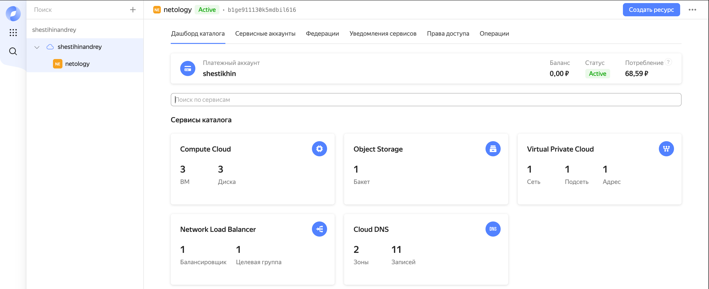
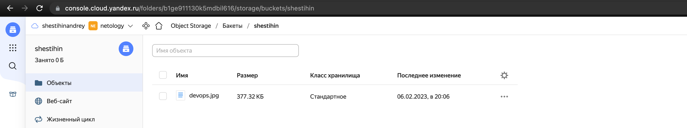
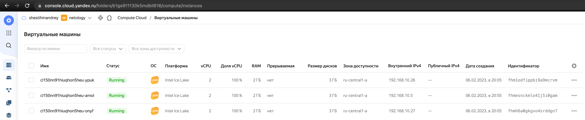
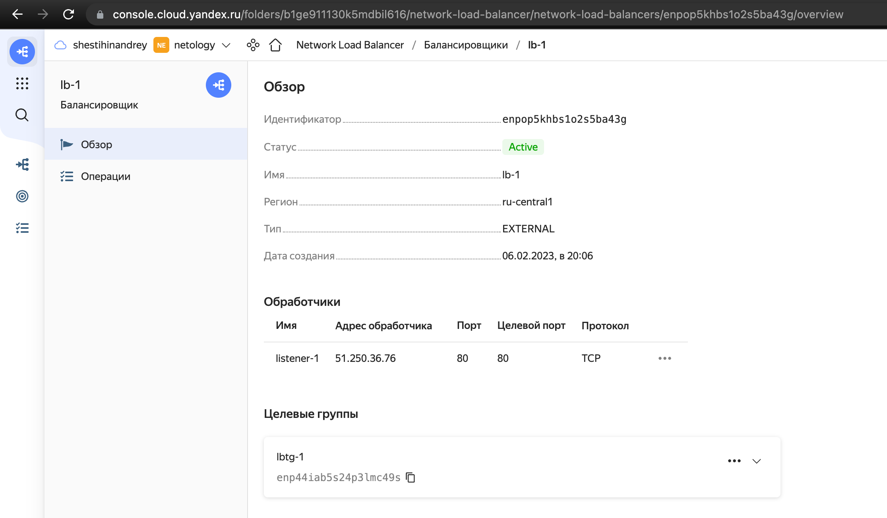
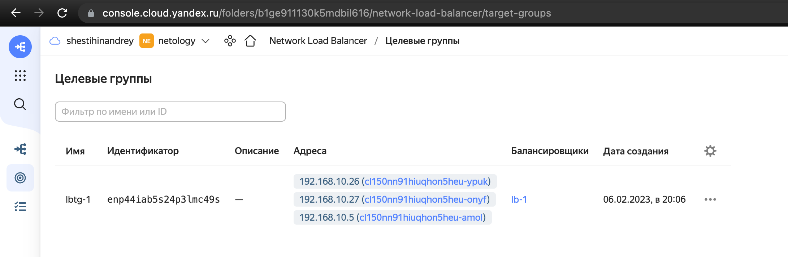

## Задание 1. Яндекс.Облако (обязательное к выполнению)

1. Создать bucket Object Storage и разместить там файл с картинкой:
- Создать bucket в Object Storage с произвольным именем (например, _имя_студента_дата_);
- Положить в bucket файл с картинкой;
- Сделать файл доступным из Интернет.
2. Создать группу ВМ в public подсети фиксированного размера с шаблоном LAMP и web-страничкой, содержащей ссылку на картинку из bucket:
- Создать Instance Group с 3 ВМ и шаблоном LAMP. Для LAMP рекомендуется использовать `image_id = fd827b91d99psvq5fjit`;
- Для создания стартовой веб-страницы рекомендуется использовать раздел `user_data` в [meta_data](https://cloud.yandex.ru/docs/compute/concepts/vm-metadata);
- Разместить в стартовой веб-странице шаблонной ВМ ссылку на картинку из bucket;
- Настроить проверку состояния ВМ.
3. Подключить группу к сетевому балансировщику:
- Создать сетевой балансировщик;
- Проверить работоспособность, удалив одну или несколько ВМ.
4. *Создать Application Load Balancer с использованием Instance group и проверкой состояния.

<p align="left">
  
</p>

<p align="left">
  
</p>

<p align="left">
  
</p>

<p align="left">
  
</p>

<p align="left">
  
</p>

<p align="left">
  
</p>

<p align="left">
  
</p>

<p align="left">
  
</p>


```bash
Plan: 9 to add, 0 to change, 0 to destroy.

Changes to Outputs:
  + ig-1 = (known after apply)

Do you want to perform these actions?
  Terraform will perform the actions described above.
  Only 'yes' will be accepted to approve.

  Enter a value: yes

yandex_iam_service_account.ig-sa: Creating...
yandex_vpc_network.network-1: Creating...
yandex_storage_bucket.shestihin: Creating...
yandex_vpc_network.network-1: Creation complete after 8s [id=enprs7t00k0agfr78fl7]
yandex_vpc_subnet.subnet-1: Creating...
yandex_iam_service_account.ig-sa: Creation complete after 8s [id=aje6ucs24enc8u5k4dob]
yandex_resourcemanager_folder_iam_binding.editor: Creating...
yandex_vpc_subnet.subnet-1: Creation complete after 1s [id=e9ba1pv63n41v64406qj]
yandex_compute_instance_group.ig-1: Creating...
yandex_resourcemanager_folder_iam_binding.editor: Creation complete after 2s [id=b1ge911130k5mdbil616/editor]
yandex_storage_bucket.shestihin: Still creating... [10s elapsed]
yandex_compute_instance_group.ig-1: Still creating... [10s elapsed]
yandex_storage_bucket.shestihin: Still creating... [20s elapsed]
yandex_compute_instance_group.ig-1: Still creating... [20s elapsed]
yandex_storage_bucket.shestihin: Still creating... [30s elapsed]
yandex_compute_instance_group.ig-1: Still creating... [30s elapsed]
yandex_storage_bucket.shestihin: Still creating... [40s elapsed]
yandex_compute_instance_group.ig-1: Still creating... [40s elapsed]
yandex_storage_bucket.shestihin: Still creating... [50s elapsed]
yandex_compute_instance_group.ig-1: Still creating... [50s elapsed]
yandex_storage_bucket.shestihin: Still creating... [1m0s elapsed]
yandex_compute_instance_group.ig-1: Still creating... [1m0s elapsed]
yandex_storage_bucket.shestihin: Still creating... [1m10s elapsed]
yandex_storage_bucket.shestihin: Creation complete after 1m14s [id=shestihin]
yandex_storage_object.image-object: Creating...
yandex_compute_instance_group.ig-1: Creation complete after 1m5s [id=cl150nn91hiuqhon5heu]
yandex_lb_target_group.lbtg-1: Creating...
yandex_lb_target_group.lbtg-1: Creation complete after 5s [id=enp44iab5s24p3lmc49s]
yandex_lb_network_load_balancer.lb-1: Creating...
yandex_storage_object.image-object: Creation complete after 8s [id=devops.jpg]
yandex_lb_network_load_balancer.lb-1: Creation complete after 3s [id=enpop5khbs1o2s5ba43g]

Apply complete! Resources: 9 added, 0 changed, 0 destroyed.
```


Документация
- [Compute instance group](https://registry.terraform.io/providers/yandex-cloud/yandex/latest/docs/resources/compute_instance_group)
- [Network Load Balancer](https://registry.terraform.io/providers/yandex-cloud/yandex/latest/docs/resources/lb_network_load_balancer)
- [Группа ВМ с сетевым балансировщиком](https://cloud.yandex.ru/docs/compute/operations/instance-groups/create-with-balancer)