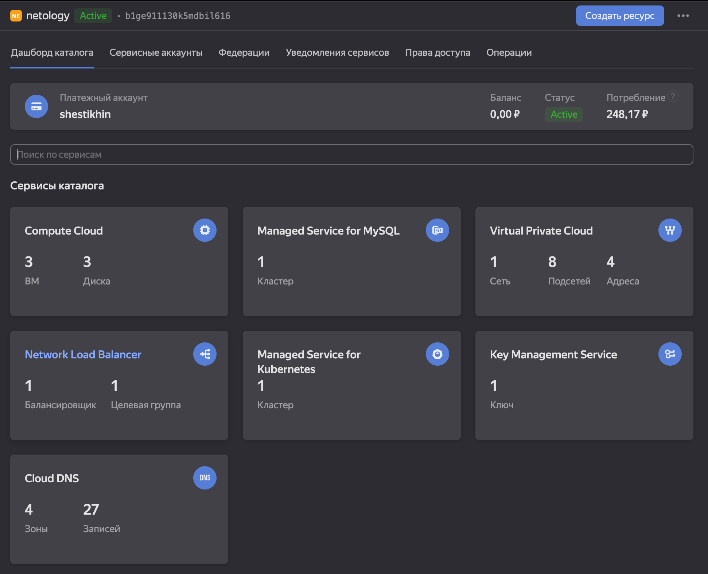
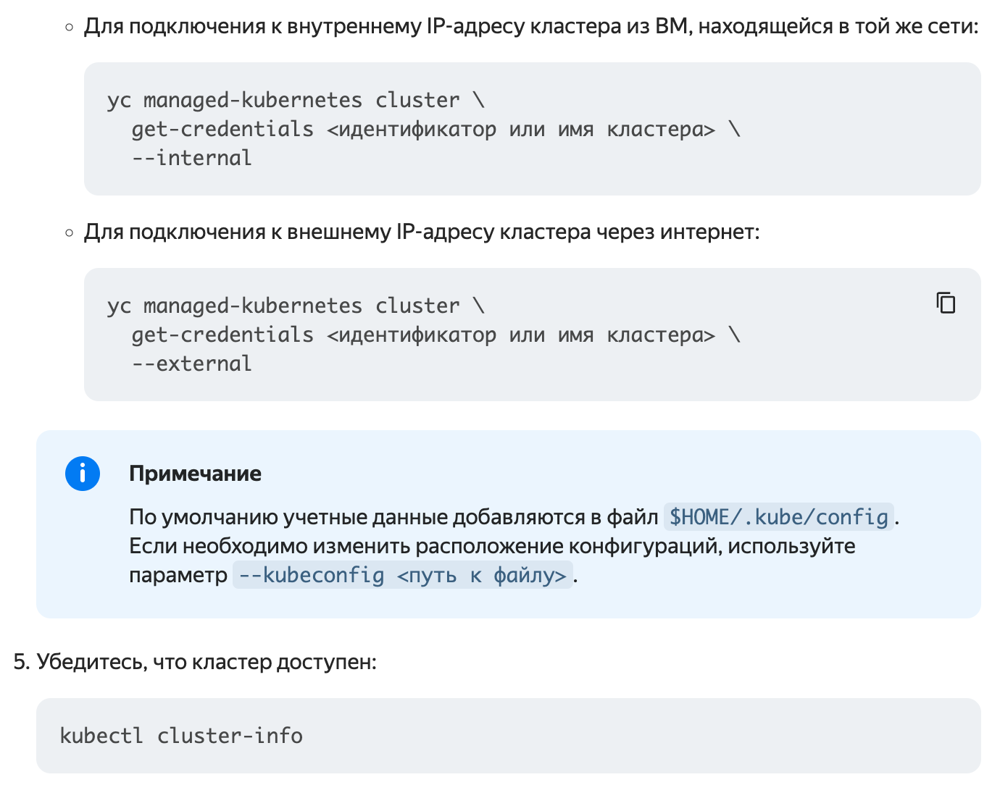
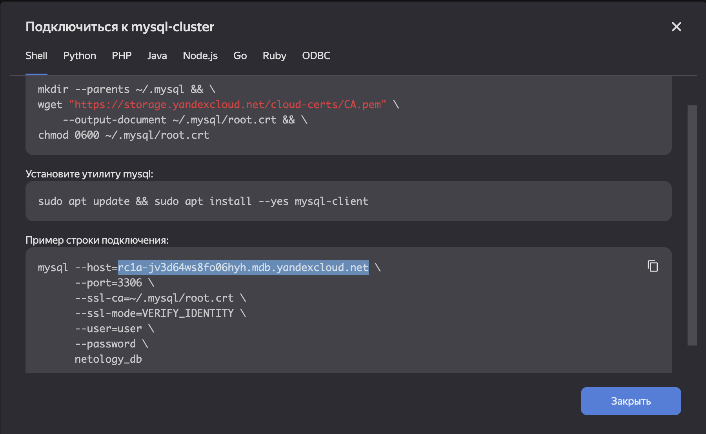
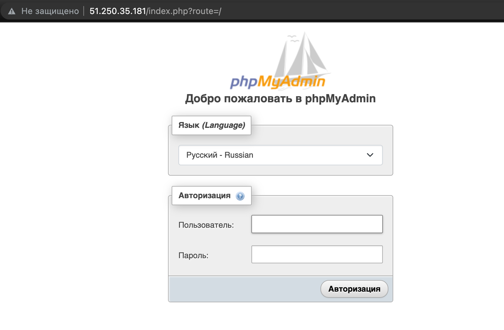

## Задание 1. Яндекс.Облако (обязательное к выполнению)

1. Настроить с помощью Terraform кластер баз данных MySQL:
- Используя настройки VPC с предыдущих ДЗ, добавить дополнительно подсеть private в разных зонах, чтобы обеспечить отказоустойчивость 
- Разместить ноды кластера MySQL в разных подсетях
- Необходимо предусмотреть репликацию с произвольным временем технического обслуживания
- Использовать окружение PRESTABLE, платформу Intel Broadwell с производительностью 50% CPU и размером диска 20 Гб
- Задать время начала резервного копирования - 23:59
- Включить защиту кластера от непреднамеренного удаления
- Создать БД с именем `netology_db` c логином и паролем

2. Настроить с помощью Terraform кластер Kubernetes
- Используя настройки VPC с предыдущих ДЗ, добавить дополнительно 2 подсети public в разных зонах, чтобы обеспечить отказоустойчивость
- Создать отдельный сервис-аккаунт с необходимыми правами 
- Создать региональный мастер kubernetes с размещением нод в разных 3 подсетях
- Добавить возможность шифрования ключом из KMS, созданного в предыдущем ДЗ
- Создать группу узлов состояющую из 3 машин с автомасштабированием до 6
- Подключиться к кластеру с помощью `kubectl`
- *Запустить микросервис phpmyadmin и подключиться к БД, созданной ранее
- *Создать сервис типы Load Balancer и подключиться к phpmyadmin. Предоставить скриншот с публичным адресом и подключением к БД

<p align="left">
  
</p>

<p align="left">
  
</p>

```bash
andreyshestikhin@MacBook-Air-Andrey ~ % kubectl cluster-info           
Kubernetes control plane is running at https://51.250.38.122
CoreDNS is running at https://51.250.38.122/api/v1/namespaces/kube-system/services/kube-dns:dns/proxy
```
```bash
andreyshestikhin@MacBook-Air-Andrey ~ % kubectl get pod                                 
NAME                          READY   STATUS    RESTARTS   AGE
phpmyadmin-5d4d4c65bd-6tzpm   1/1     Running   0          108m
phpmyadmin-5d4d4c65bd-mn7lz   1/1     Running   0          108m
andreyshestikhin@MacBook-Air-Andrey ~ % kubectl get deployment
NAME         READY   UP-TO-DATE   AVAILABLE   AGE
phpmyadmin   2/2     2            2           109m
andreyshestikhin@MacBook-Air-Andrey ~ % kubectl get service   
NAME                TYPE           CLUSTER-IP     EXTERNAL-IP     PORT(S)        AGE
kubernetes          ClusterIP      10.96.128.1    <none>          443/TCP        3h25m
phpmyadmin-svc-lb   LoadBalancer   10.96.163.96   51.250.35.181   80:30640/TCP   109m
```

<p align="left">
  
</p>

<p align="left">
  
</p>

[Terraform config](https://github.com/sisipka/terraform-ya-cluster-k8s-mysql)

Документация
- [MySQL cluster](https://registry.terraform.io/providers/yandex-cloud/yandex/latest/docs/resources/mdb_mysql_cluster)
- [Создание кластера kubernetes](https://cloud.yandex.ru/docs/managed-kubernetes/operations/kubernetes-cluster/kubernetes-cluster-create)
- [K8S Cluster](https://registry.terraform.io/providers/yandex-cloud/yandex/latest/docs/resources/kubernetes_cluster)
- [K8S node group](https://registry.terraform.io/providers/yandex-cloud/yandex/latest/docs/resources/kubernetes_node_group)