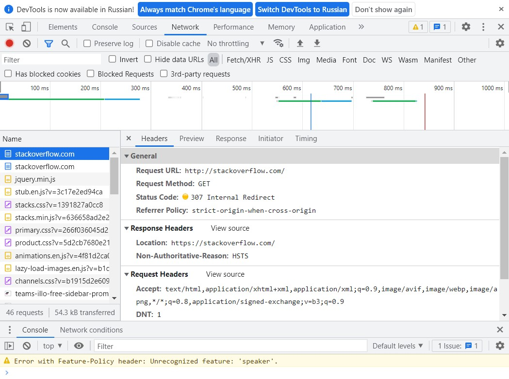
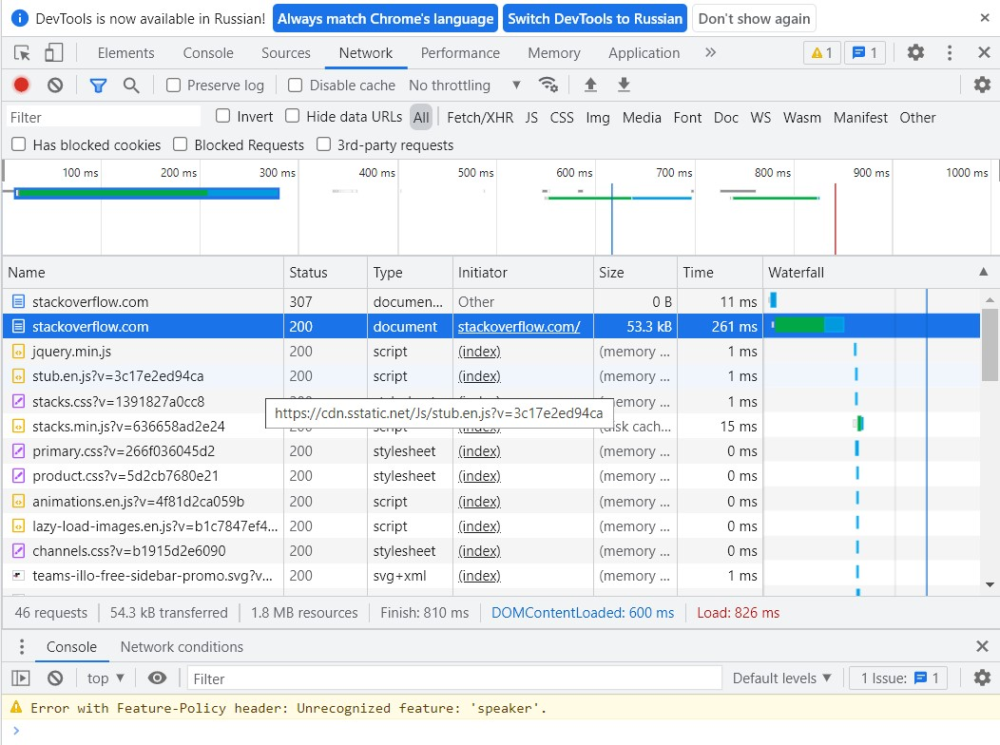

1. Работа c HTTP через телнет.
- Подключитесь утилитой телнет к сайту stackoverflow.com
`telnet stackoverflow.com 80`
- отправьте HTTP запрос
```bash
GET /questions HTTP/1.0
HOST: stackoverflow.com
[press enter]
[press enter]
```
- В ответе укажите полученный HTTP код, что он означает?

```bash
lsd@nucub:~$ telnet stackoverflow.com 80

Trying 151.101.129.69...

Connected to stackoverflow.com.

Escape character is '^]'.

GET /questions HTTP/1.0

HOST: stackoverflow.com

HTTP/1.1 301 Moved Permanently

cache-control: no-cache, no-store, must-revalidate

location: https://stackoverflow.com/questions

x-request-guid: e5d17ace-bb78-4186-9737-3ebf3e34c687

feature-policy: microphone 'none'; speaker 'none'

content-security-policy: upgrade-insecure-requests; frame-ancestors 'self' https://stackexchange.com

Accept-Ranges: bytes

Date: Sun, 20 Feb 2022 15:29:19 GMT

Via: 1.1 varnish

Connection: close

X-Served-By: cache-fra19179-FRA

X-Cache: MISS

X-Cache-Hits: 0

X-Timer: S1645370959.087327,VS0,VE85

Vary: Fastly-SSL

X-DNS-Prefetch-Control: off

Set-Cookie: prov=66d86212-b173-5007-0b46-65d5b16be935; domain=.stackoverflow.com; expires=Fri, 01-Jan-2055 00:00:00 GMT; path=/; HttpOnly

Connection closed by foreign host.
```
Код 301 - редирект с HTTP на HTTPS протокол того же url

2. Повторите задание 1 в браузере, используя консоль разработчика F12.
- откройте вкладку `Network`
- отправьте запрос http://stackoverflow.com
- найдите первый ответ HTTP сервера, откройте вкладку `Headers`
- укажите в ответе полученный HTTP код.
- проверьте время загрузки страницы, какой запрос обрабатывался дольше всего?
- приложите скриншот консоли браузера в ответ.

В ответ получили код 307

<p align="left">
  
</p>

Страница полностью загрузилась за 826 мс. Самый долгий запрос - начальная загрузка страницы 261 мс.

<p align="left">
  
</p>

3. Какой IP адрес у вас в интернете?

```bash
lsd@nucub:~$ wget -qO- ipecho.net | grep "Your IP"

<h1>Your IP is 178.70.205.183</h1>
```

4. Какому провайдеру принадлежит ваш IP адрес? Какой автономной системе AS? Воспользуйтесь утилитой `whois`

```bash
lsd@nucub:~$ whois 178.70.205.183 | grep ^origin

origin: AS12389

lsd@nucub:~$ whois 178.70.205.183 | grep ^descr

descr: PJSC Rostelecom
```

5. Через какие сети проходит пакет, отправленный с вашего компьютера на адрес 8.8.8.8? Через какие AS? Воспользуйтесь утилитой `traceroute`

```bash
lsd@nucub:~$ traceroute -An 8.8.8.8

traceroute to 8.8.8.8 (8.8.8.8), 30 hops max, 60 byte packets

1 192.168.0.1 [*] 0.758 ms 1.356 ms 1.500 ms

2 212.48.195.243 [AS12389] 17.512 ms 17.865 ms 20.163 ms

3 212.48.194.130 [AS12389] 21.293 ms 23.606 ms 28.404 ms

4 188.254.2.4 [AS12389] 28.461 ms 28.105 ms 32.500 ms

5 87.226.194.47 [AS12389] 33.348 ms 34.397 ms 40.166 ms

6 74.125.244.132 [AS15169] 38.268 ms 25.616 ms 22.664 ms

7 142.251.61.219 [AS15169] 57.533 ms 72.14.232.85 [AS15169] 16.985 ms 21.387 ms

8 142.251.51.187 [AS15169] 35.272 ms 142.250.238.181 [AS15169] 30.578 ms 142.251.51.187 [AS15169] 34.897 ms

9 172.253.51.189 [AS15169] 33.205 ms * *

10 * * *

11 * * *

12 * * *

13 * * *

14 * * *

15 * * *

16 * * *

17 * * *

18 * * *

19 8.8.8.8 [AS15169] 27.681 ms 26.054 ms *

lsd@nucub:~$ whois AS12389 | grep ^org-name

org-name: PJSC Rostelecom

lsd@nucub:~$ whois AS15169 | grep ^OrgName

OrgName: Google LLC
```

6. Повторите задание 5 в утилите `mtr`. На каком участке наибольшая задержка - delay?

```bash
lsd@nucub:~$ mtr 8.8.8.8 -znrc 1

Start: 2022-02-20T19:04:05+0000

HOST: nucub Loss% Snt Last Avg Best Wrst StDev

AS??? 192.168.0.1 0.0% 1 1.1 1.1 1.1 1.1 0.0
AS12389 212.48.195.243 0.0% 1 16.4 16.4 16.4 16.4 0.0
AS12389 212.48.194.130 0.0% 1 16.2 16.2 16.2 16.2 0.0
AS12389 188.254.2.6 0.0% 1 19.2 19.2 19.2 19.2 0.0
AS12389 87.226.194.47 0.0% 1 21.2 21.2 21.2 21.2 0.0
AS15169 74.125.244.180 0.0% 1 20.0 20.0 20.0 20.0 0.0
AS15169 142.251.61.219 0.0% 1 23.2 23.2 23.2 23.2 0.0
AS15169 216.239.62.15 0.0% 1 22.7 22.7 22.7 22.7 0.0
AS??? ??? 100.0 1 0.0 0.0 0.0 0.0 0.0
AS??? ??? 100.0 1 0.0 0.0 0.0 0.0 0.0
AS??? ??? 100.0 1 0.0 0.0 0.0 0.0 0.0
AS??? ??? 100.0 1 0.0 0.0 0.0 0.0 0.0
AS??? ??? 100.0 1 0.0 0.0 0.0 0.0 0.0
AS??? ??? 100.0 1 0.0 0.0 0.0 0.0 0.0
AS??? ??? 100.0 1 0.0 0.0 0.0 0.0 0.0
AS??? ??? 100.0 1 0.0 0.0 0.0 0.0 0.0
AS??? ??? 100.0 1 0.0 0.0 0.0 0.0 0.0
AS15169 8.8.8.8 0.0% 1 155.5 155.5 155.5 155.5 0.0
```
Наибольшая задержка на 18 хопе

7. Какие DNS сервера отвечают за доменное имя dns.google? Какие A записи? воспользуйтесь утилитой `dig`

```bash
lsd@nucub:~$ dig +short NS dns.google

ns4.zdns.google.

ns1.zdns.google.

ns3.zdns.google.

ns2.zdns.google.

NS записи

lsd@nucub:~$ dig +short A dns.google

8.8.8.8

8.8.4.4
```

8. Проверьте PTR записи для IP адресов из задания 7. Какое доменное имя привязано к IP? воспользуйтесь утилитой `dig`

```bash
lsd@nucub:~$ for ip in dig +short A dns.google; do dig -x $ip | grep ^[0-9].*in-addr; done

8.8.8.8.in-addr.arpa. 14400 IN PTR dns.google.

4.4.8.8.in-addr.arpa. 14400 IN PTR dns.google.
```
