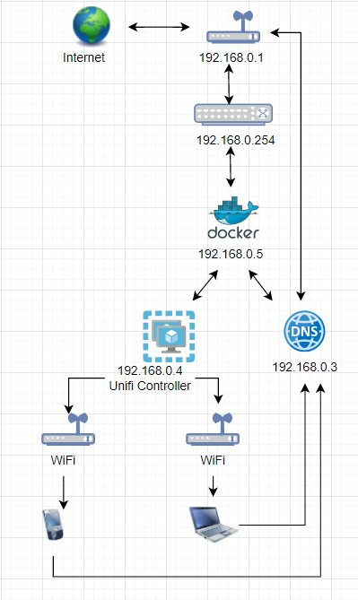

1. Подключитесь к публичному маршрутизатору в интернет. Найдите маршрут к вашему публичному IP
```
telnet route-views.routeviews.org
Username: rviews
show ip route x.x.x.x/32
show bgp x.x.x.x/32
```
```
                RouteViews BGP Route Viewer
                route-views.routeviews.org
route views data is archived on http://archive.routeviews.org

This hardware is part of a grant by the NSF. Please contact help@routeviews.org if you have questions, or if you wish to contribute your view.

This router has views of full routing tables from several ASes. The list of peers is located at http://www.routeviews.org/peers in route-views.oregon-ix.net.txt

NOTE: The hardware was upgraded in August 2014. If you are seeing the error message, "no default Kerberos realm", you may want to in Mac OS X add "default unset autologin" to your ~/.telnetrc

To login, use the username "rviews".

User Access Verification

Username: rviews

route-views>show ip route 178.70.205.183 Routing entry for 178.70.0.0/15, supernet Known via "bgp 6447", distance 20, metric 0 Tag 2497, type external Last update from 202.232.0.2 2w0d ago Routing Descriptor Blocks:

202.232.0.2, from 202.232.0.2, 2w0d ago Route metric is 0, traffic share count is 1 AS Hops 2 Route tag 2497 MPLS label: none route-views>show bgp 178.70.205.183 BGP routing table entry for 178.70.0.0/15, version 307706608 Paths: (23 available, best #18, table default) Not advertised to any peer Refresh Epoch 1 3333 1103 12389, (aggregated by 12389 212.48.198.56) 193.0.0.56 from 193.0.0.56 (193.0.0.56) Origin IGP, localpref 100, valid, external path 7FE0A67D0EF0 RPKI State valid rx pathid: 0, tx pathid: 0 Refresh Epoch 1 8283 1299 12389, (aggregated by 12389 212.48.198.56) 94.142.247.3 from 94.142.247.3 (94.142.247.3) Origin IGP, metric 0, localpref 100, valid, external Community: 1299:30000 8283:1 8283:101 8283:103 unknown transitive attribute: flag 0xE0 type 0x20 length 0x24 value 0000 205B 0000 0000 0000 0001 0000 205B 0000 0005 0000 0001 0000 205B 0000 0005 0000 0003 path 7FE1879660B8 RPKI State valid rx pathid: 0, tx pathid: 0 Refresh Epoch 1 1351 6939 12389, (aggregated by 12389 212.48.198.56) 132.198.255.253 from 132.198.255.253 (132.198.255.253) Origin IGP, localpref 100, valid, external path 7FE0E5AF1BB0 RPKI State valid rx pathid: 0, tx pathid: 0 Refresh Epoch 1 57866 3356 12389, (aggregated by 12389 212.48.198.56) 37.139.139.17 from 37.139.139.17 (37.139.139.17) Origin IGP, metric 0, localpref 100, valid, external Community: 3356:2 3356:22 3356:100 3356:123 3356:501 3356:901 3356:2065 path 7FE0B1E53248 RPKI State valid rx pathid: 0, tx pathid: 0 Refresh Epoch 1 852 3356 12389, (aggregated by 12389 212.48.198.56) 154.11.12.212 from 154.11.12.212 (96.1.209.43) Origin IGP, metric 0, localpref 100, valid, external path 7FE108B20938 RPKI State valid rx pathid: 0, tx pathid: 0 Refresh Epoch 1 20130 6939 12389, (aggregated by 12389 212.48.198.56) 140.192.8.16 from 140.192.8.16 (140.192.8.16) Origin IGP, localpref 100, valid, external path 7FE0A9B52390 RPKI State valid rx pathid: 0, tx pathid: 0 Refresh Epoch 1 701 1273 12389, (aggregated by 12389 212.48.198.56) 137.39.3.55 from 137.39.3.55 (137.39.3.55) Origin IGP, localpref 100, valid, external path 7FE183D95A08 RPKI State valid rx pathid: 0, tx pathid: 0 Refresh Epoch 1 3549 3356 12389, (aggregated by 12389 212.48.198.56) 208.51.134.254 from 208.51.134.254 (67.16.168.191) Origin IGP, metric 0, localpref 100, valid, external Community: 3356:2 3356:22 3356:100 3356:123 3356:501 3356:901 3356:2065 3549:2581 3549:30840 path 7FE0B5697FC8 RPKI State valid rx pathid: 0, tx pathid: 0 Refresh Epoch 1 53767 174 12389, (aggregated by 12389 212.48.198.56) 162.251.163.2 from 162.251.163.2 (162.251.162.3) Origin IGP, localpref 100, valid, external Community: 174:21101 174:22005 53767:5000 path 7FE18D6E0D30 RPKI State valid rx pathid: 0, tx pathid: 0 Refresh Epoch 1 3356 12389, (aggregated by 12389 212.48.198.56) 4.68.4.46 from 4.68.4.46 (4.69.184.201) Origin IGP, metric 0, localpref 100, valid, external Community: 3356:2 3356:22 3356:100 3356:123 3356:501 3356:901 3356:2065 path 7FE050A7B268 RPKI State valid rx pathid: 0, tx pathid: 0 Refresh Epoch 1 4901 6079 3356 12389, (aggregated by 12389 212.48.198.56) 162.250.137.254 from 162.250.137.254 (162.250.137.254) Origin IGP, localpref 100, valid, external Community: 65000:10100 65000:10300 65000:10400 path 7FE1681D1248 RPKI State valid rx pathid: 0, tx pathid: 0 Refresh Epoch 1 20912 3257 3356 12389, (aggregated by 12389 212.48.198.56) 212.66.96.126 from 212.66.96.126 (212.66.96.126) Origin IGP, localpref 100, valid, external Community: 3257:8070 3257:30515 3257:50001 3257:53900 3257:53902 20912:65004 path 7FE0B7DFF1F0 RPKI State valid rx pathid: 0, tx pathid: 0 Refresh Epoch 1 3303 12389, (aggregated by 12389 212.48.198.56) 217.192.89.50 from 217.192.89.50 (138.187.128.158) Origin IGP, localpref 100, valid, external Community: 3303:1004 3303:1006 3303:1030 3303:3056 path 7FE0284654B0 RPKI State valid rx pathid: 0, tx pathid: 0 Refresh Epoch 1 7018 3356 12389, (aggregated by 12389 212.48.198.56) 12.0.1.63 from 12.0.1.63 (12.0.1.63) Origin IGP, localpref 100, valid, external Community: 7018:5000 7018:37232 path 7FE111E8EE88 RPKI State valid rx pathid: 0, tx pathid: 0 Refresh Epoch 1 3561 3910 3356 12389, (aggregated by 12389 212.48.198.56) 206.24.210.80 from 206.24.210.80 (206.24.210.80) Origin IGP, localpref 100, valid, external path 7FE14A338A58 RPKI State valid rx pathid: 0, tx pathid: 0 Refresh Epoch 1 6939 12389, (aggregated by 12389 212.48.198.56) 64.71.137.241 from 64.71.137.241 (216.218.252.164) Origin IGP, localpref 100, valid, external path 7FE04033F2C8 RPKI State valid rx pathid: 0, tx pathid: 0 Refresh Epoch 1 101 174 12389, (aggregated by 12389 212.48.198.56) 209.124.176.223 from 209.124.176.223 (209.124.176.223) Origin IGP, localpref 100, valid, external Community: 101:20100 101:20110 101:22100 174:21101 174:22005 Extended Community: RT:101:22100 path 7FE04E5A5158 RPKI State valid rx pathid: 0, tx pathid: 0 Refresh Epoch 2 2497 12389, (aggregated by 12389 212.48.198.56) 202.232.0.2 from 202.232.0.2 (58.138.96.254) Origin IGP, localpref 100, valid, external, best path 7FE11C329FB0 RPKI State valid rx pathid: 0, tx pathid: 0x0 Refresh Epoch 1 7660 2516 12389, (aggregated by 12389 212.48.198.56) 203.181.248.168 from 203.181.248.168 (203.181.248.168) Origin IGP, localpref 100, valid, external Community: 2516:1050 7660:9001 path 7FE165137A28 RPKI State valid rx pathid: 0, tx pathid: 0 Refresh Epoch 1 49788 12552 12389, (aggregated by 12389 212.48.198.56) 91.218.184.60 from 91.218.184.60 (91.218.184.60) Origin IGP, localpref 100, valid, external Community: 12552:12000 12552:12100 12552:12101 12552:22000 Extended Community: 0x43💯1 path 7FE16A95BB68 RPKI State valid rx pathid: 0, tx pathid: 0 Refresh Epoch 1 1221 4637 12389, (aggregated by 12389 212.48.198.56) 203.62.252.83 from 203.62.252.83 (203.62.252.83) Origin IGP, localpref 100, valid, external path 7FE109C845D0 RPKI State valid rx pathid: 0, tx pathid: 0 Refresh Epoch 1 3257 1299 12389, (aggregated by 12389 212.48.198.56) 89.149.178.10 from 89.149.178.10 (213.200.83.26) Origin IGP, metric 10, localpref 100, valid, external Community: 3257:8794 3257:30052 3257:50001 3257:54900 3257:54901 path 7FE11BC90040 RPKI State valid rx pathid: 0, tx pathid: 0 Refresh Epoch 1 19214 174 12389, (aggregated by 12389 212.48.198.56) 208.74.64.40 from 208.74.64.40 (208.74.64.40) Origin IGP, localpref 100, valid, external Community: 174:21101 174:22005 path 7FE04C6A1970 RPKI State valid rx pathid: 0, tx pathid: 0
```

2. Создайте dummy0 интерфейс в Ubuntu. Добавьте несколько статических маршрутов. Проверьте таблицу маршрутизации.

```
lsd@nucub:~$ ip a | grep dummy

4: dummy0: <BROADCAST,NOARP> mtu 1500 qdisc noop state DOWN group default qlen 1000

inet 192.168.10.1/24 scope global dummy0
lsd@nucub:~$ sudo ip route add 192.168.10.1 via 192.168.0.3

lsd@nucub:~$ ip r

default via 192.168.0.1 dev enp3s0 proto static

172.17.0.0/16 dev docker0 proto kernel scope link src 172.17.0.1

192.168.0.0/24 dev enp3s0 proto kernel scope link src 192.168.0.3

192.168.10.1 via 192.168.0.3 dev enp3s0
```

3. Проверьте открытые TCP порты в Ubuntu, какие протоколы и приложения используют эти порты? Приведите несколько примеров.

```
lsd@nucub:~$ sudo ss -tnlp [sudo] password for lsd: State Recv-Q Send-Q Local Address:Port Peer Address:Port Process
LISTEN 0 4096 0.0.0.0:8000 0.0.0.0:* users:(("docker-proxy",pid=1508,fd=4))
LISTEN 0 4096 0.0.0.0:49153 0.0.0.0:* users:(("docker-proxy",pid=11570,fd=4))
LISTEN 0 4096 0.0.0.0:49154 0.0.0.0:* users:(("docker-proxy",pid=11614,fd=4))
LISTEN 0 4096 0.0.0.0:9443 0.0.0.0:* users:(("docker-proxy",pid=1466,fd=4))
LISTEN 0 4096 0.0.0.0:9000 0.0.0.0:* users:(("docker-proxy",pid=1486,fd=4))
LISTEN 0 4096 127.0.0.1:39729 0.0.0.0:* users:(("containerd",pid=811,fd=12))
LISTEN 0 4096 127.0.0.53%lo:53 0.0.0.0:* users:(("systemd-resolve",pid=728,fd=13))
LISTEN 0 128 0.0.0.0:22 0.0.0.0:* users:(("sshd",pid=984,fd=3))
LISTEN 0 4096 [::]:8000 [::]:* users:(("docker-proxy",pid=1516,fd=4))
LISTEN 0 4096 [::]:49153 [::]:* users:(("docker-proxy",pid=11577,fd=4))
LISTEN 0 4096 [::]:49154 [::]:* users:(("docker-proxy",pid=11622,fd=4))
LISTEN 0 4096 [::]:9443 [::]:* users:(("docker-proxy",pid=1473,fd=4))
LISTEN 0 4096 [::]:9000 [::]:* users:(("docker-proxy",pid=1494,fd=4))
LISTEN 0 128 [::]:22

22 - ssh 53 - DNS
```

4. Проверьте используемые UDP сокеты в Ubuntu, какие протоколы и приложения используют эти порты?

```
lsd@nucub:~$ sudo ss -unap State Recv-Q Send-Q Local Address:Port Peer Address:Port Process
UNCONN 0 0 0.0.0.0:49153 0.0.0.0:* users:(("docker-proxy",pid=11591,fd=4))
UNCONN 0 0 0.0.0.0:49154 0.0.0.0:* users:(("docker-proxy",pid=11636,fd=4))
UNCONN 0 0 127.0.0.53%lo:53 0.0.0.0:* users:(("systemd-resolve",pid=728,fd=12))
UNCONN 0 0 [::]:49153 [::]:* users:(("docker-proxy",pid=11597,fd=4))
UNCONN 0 0 [::]:49154 [::]:* users:(("docker-proxy",pid=11642,fd=4))
UNCONN 0 0 [fe80::baae:edff:fe7c:e47b]%enp3s0:546 [::]:* users:(("systemd-network",pid=725,fd=15))

53 - DNS 49153, 49154 - docker
```

5. Используя diagrams.net, создайте L3 диаграмму вашей домашней сети или любой другой сети, с которой вы работали. 

<p align="left">
  
</p>
