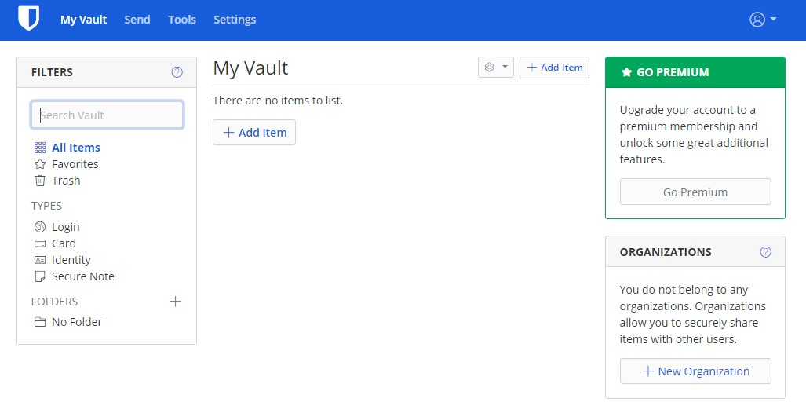
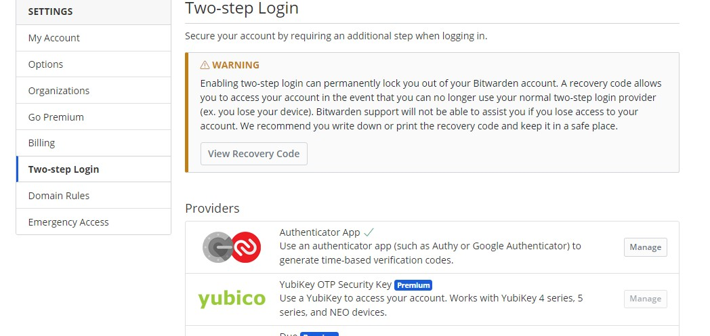
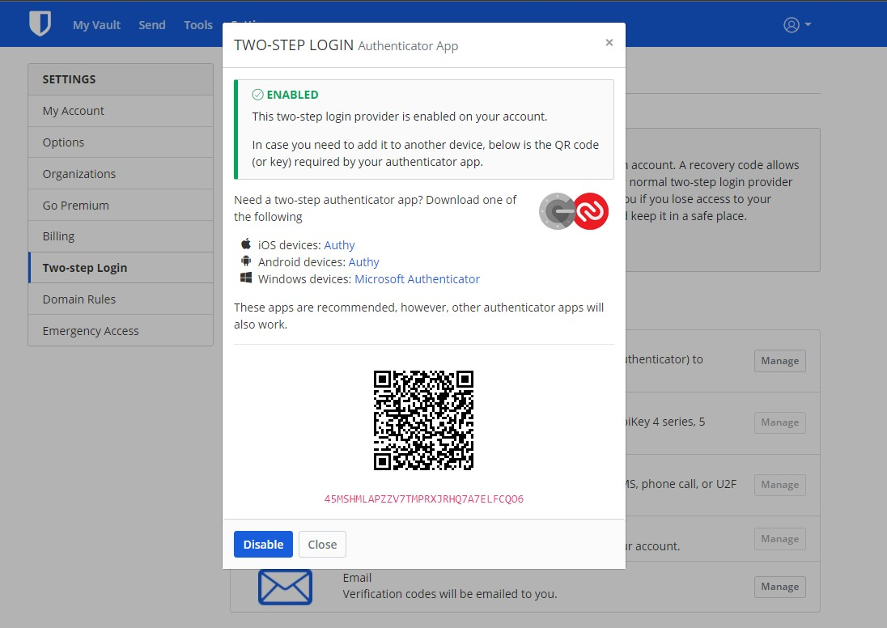
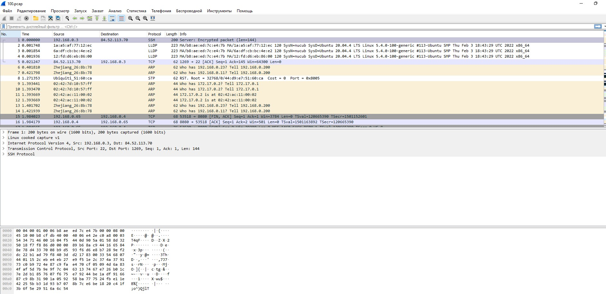

1. Установите `Bitwarden плагин` для браузера. Зарегестрируйтесь и сохраните несколько паролей.

<p align="left">
  
</p>


2. Установите Google authenticator на мобильный телефон. Настройте вход в Bitwarden акаунт через Google authenticator OTP.

<p align="left">
  
</p>

<p align="left">
  
</p>


3. Установите apache2, сгенерируйте самоподписанный сертификат, настройте тестовый сайт для работы по HTTPS.

```bash
lsd@nucub:~$ sudo openssl req -x509 -nodes -days 365 -newkey rsa:2048 -keyout /etc/ssl/private/apache-selfsigned.key -out /etc/ssl/certs/apache-selfsigned.crt

[sudo] password for lsd:

Generating a RSA private key

....+++++

.......................................................................................+++++
writing new private key to '/etc/ssl/private/apache-selfsigned.key'
You are about to be asked to enter information that will be incorporated into your certificate request. What you are about to enter is what is called a Distinguished Name or a DN. There are quite a few fields but you can leave some blank For some fields there will be a default value, If you enter '.', the field will be left blank.
Country Name (2 letter code) [AU]:RU

State or Province Name (full name) [Some-State]:SPb

Locality Name (eg, city) []:

Organization Name (eg, company) [Internet Widgits Pty Ltd]:Nuc

Organizational Unit Name (eg, section) []:

Common Name (e.g. server FQDN or YOUR name) []:Andrew

Email Address []:

lsd@nucub:~$ ls -l /etc/ssl

total 32

drwxr-xr-x 2 root root 16384 Mar 2 08:13 certs

-rw-r--r-- 1 root root 10909 Apr 20 2020 openssl.cnf

drwx--x--- 2 root ssl-cert 4096 Mar 2 08:12 private

lsd@nucub:~$ sudo cat /etc/apache2/conf-available/ssl-params.conf

SSLCipherSuite EECDH+AESGCM:EDH+AESGCM:AES256+EECDH:AES256+EDH

SSLProtocol All -SSLv2 -SSLv3 -TLSv1 -TLSv1.1

SSLHonorCipherOrder On

Disable preloading HSTS for now. You can use the commented out header line that includes
the "preload" directive if you understand the implications.
Header always set Strict-Transport-Security "max-age=63072000; includeSubDomains; preload"
Header always set X-Frame-Options DENY

Header always set X-Content-Type-Options nosniff

Requires Apache >= 2.4
SSLCompression off

SSLUseStapling on

SSLStaplingCache "shmcb:logs/stapling-cache(150000)"

Requires Apache >= 2.4.11
SSLSessionTickets Off

lsd@nucub:~$ sudo a2enmod ssl

Considering dependency setenvif for ssl:

Module setenvif already enabled

Considering dependency mime for ssl:

Module mime already enabled

Considering dependency socache_shmcb for ssl:

Enabling module socache_shmcb.

Enabling module ssl.

See /usr/share/doc/apache2/README.Debian.gz on how to configure SSL and create self-signed certificates.

To activate the new configuration, you need to run:

systemctl restart apache2

lsd@nucub:~$ sudo a2enmod headers

Enabling module headers.

To activate the new configuration, you need to run:

systemctl restart apache2

lsd@nucub:~$

lsd@nucub:~$ sudo a2ensite default-ssl

Enabling site default-ssl.

To activate the new configuration, you need to run:

systemctl reload apache2

lsd@nucub:~$

lsd@nucub:~$ sudo a2enconf ssl-params

Enabling conf ssl-params.

To activate the new configuration, you need to run:

systemctl reload apache2

lsd@nucub:~$

lsd@nucub:~$ sudo systemctl reload apache2

lsd@nucub:~$ sudo apache2ctl configtest

AH00558: apache2: Could not reliably determine the server's fully qualified domain name, using 127.0.1.1. Set the 'ServerName' directive globally to suppress this message

Syntax OK
```

4. Проверьте на `TLS` уязвимости произвольный сайт в интернете (кроме сайтов МВД, ФСБ, МинОбр, НацБанк, РосКосмос, РосАтом, РосНАНО и любых госкомпаний, объектов КИИ, ВПК ... и тому подобное).

```bash
lsd@nucub:~$ docker run --rm -ti drwetter/testssl.sh -U --sneaky https://google.com

Unable to find image 'drwetter/testssl.sh:latest' locally

latest: Pulling from drwetter/testssl.sh

5758d4e389a3: Pull complete

f96e3991d2f7: Pull complete

4f4fb700ef54: Pull complete

7709a692d48a: Pull complete

63336dd12f8c: Pull complete

8a4bdaeab9eb: Pull complete

Digest: sha256:391be8201dfe3d215d11def585a723caf05df0c7882b5d9205d22f3fdf03521f

Status: Downloaded newer image for drwetter/testssl.sh:latest

########################################################### testssl.sh 3.1dev from https://testssl.sh/dev/

  This program is free software. Distribution and
         modification under GPLv2 permitted.
  USAGE w/o ANY WARRANTY. USE IT AT YOUR OWN RISK!

   Please file bugs @ https://testssl.sh/bugs/
###########################################################

Using "OpenSSL 1.0.2-chacha (1.0.2k-dev)" [~183 ciphers]

on 6eb359457017:/home/testssl/bin/openssl.Linux.x86_64

(built: "Jan 18 17:12:17 2019", platform: "linux-x86_64")

Testing all IPv4 addresses (port 443): 108.177.14.101 108.177.14.139 108.177.14.100 108.177.14.113 108.177.14.102 108.177.14.138
Start 2022-03-02 08:51:57 -->> 108.177.14.101:443 (google.com) <<--

Further IP addresses: 209.85.233.113 209.85.233.102 209.85.233.139

                     209.85.233.100 209.85.233.101 209.85.233.138

                     2a00:1450:4010:c0b::8a 2a00:1450:4010:c0b::66

                     2a00:1450:4010:c0b::8b 2a00:1450:4010:c0b::65 
rDNS (108.177.14.101): lt-in-f101.1e100.net.

Service detected: HTTP

Testing vulnerabilities

Heartbleed (CVE-2014-0160) not vulnerable (OK), no heartbeat extension

CCS (CVE-2014-0224) not vulnerable (OK)

Ticketbleed (CVE-2016-9244), experiment. not vulnerable (OK), no session tickets

ROBOT not vulnerable (OK)

Secure Renegotiation (RFC 5746) OpenSSL handshake didn't succeed

Secure Client-Initiated Renegotiation not vulnerable (OK)

CRIME, TLS (CVE-2012-4929) not vulnerable (OK)

BREACH (CVE-2013-3587) no gzip/deflate/compress/br HTTP compression (OK) - only supplied "/" tested

POODLE, SSL (CVE-2014-3566) not vulnerable (OK)

TLS_FALLBACK_SCSV (RFC 7507) Downgrade attack prevention supported (OK)

SWEET32 (CVE-2016-2183, CVE-2016-6329) VULNERABLE, uses 64 bit block ciphers

FREAK (CVE-2015-0204) not vulnerable (OK)

DROWN (CVE-2016-0800, CVE-2016-0703) not vulnerable on this host and port (OK)

                                       make sure you don't use this certificate elsewhere with SSLv2 enabled services

                                       https://censys.io/ipv4?q=584F3034823C12AE8FDE1321CE0DA26BAE38FEBDCD891383B917D7DD4C30227C could help you to find out
LOGJAM (CVE-2015-4000), experimental not vulnerable (OK): no DH EXPORT ciphers, no DH key detected with <= TLS 1.2

BEAST (CVE-2011-3389) TLS1: ECDHE-ECDSA-AES128-SHA

                                             ECDHE-ECDSA-AES256-SHA

                                             ECDHE-RSA-AES128-SHA

                                             ECDHE-RSA-AES256-SHA

                                             AES128-SHA AES256-SHA

                                             DES-CBC3-SHA 

                                       VULNERABLE -- but also supports higher protocols  TLSv1.1 TLSv1.2 (likely mitigated)
LUCKY13 (CVE-2013-0169), experimental potentially VULNERABLE, uses cipher block chaining (CBC) ciphers with TLS. Check patches

Winshock (CVE-2014-6321), experimental not vulnerable (OK)

RC4 (CVE-2013-2566, CVE-2015-2808) no RC4 ciphers detected (OK)

Done 2022-03-02 08:53:25 [ 97s] -->> 108.177.14.101:443 (google.com) <<--
```

5. Установите на Ubuntu ssh сервер, сгенерируйте новый приватный ключ. Скопируйте свой публичный ключ на другой сервер. Подключитесь к серверу по `SSH-ключу`.

```bash
[lsd@nuc ~]$ ssh-keygen

Generating public/private rsa key pair.

Enter file in which to save the key (/home/lsd/.ssh/id_rsa):

Enter passphrase (empty for no passphrase):

Enter same passphrase again:

Your identification has been saved in /home/lsd/.ssh/id_rsa.

Your public key has been saved in /home/lsd/.ssh/id_rsa.pub.

The key fingerprint is:

SHA256:r0gcfnxLQImqAEz4znYQR4L1g4j90O72rgUBpGzOQAo lsd@nuc

The key's randomart image is:

+---[RSA 3072]----+ |E*=.. | |@+.. . . | |B=+o= . o | | o+ + . | |.= .= . S | | .+o.+ o o | | ...o = o + | | . + o + . | | .o+ . . | +----[SHA256]-----+

[lsd@nuc ~]$ ls -la .ssh/

total 12

drwx------. 2 lsd lsd 57 Mar 2 13:05 .

drwx------. 5 lsd lsd 178 Mar 2 12:59 ..

-rw-------. 1 lsd lsd 2590 Mar 2 13:05 id_rsa

-rw-r--r--. 1 lsd lsd 561 Mar 2 13:05 id_rsa.pub

-rw-r--r--. 1 lsd lsd 346 Mar 2 13:00 known_hosts

[lsd@nuc ~]$ ssh-copy-id -i .ssh/id_rsa lsd@192.168.0.3

/usr/bin/ssh-copy-id: INFO: Source of key(s) to be installed: ".ssh/id_rsa.pub"

/usr/bin/ssh-copy-id: INFO: attempting to log in with the new key(s), to filter out any that are already installed

/usr/bin/ssh-copy-id: INFO: 1 key(s) remain to be installed -- if you are prompted now it is to install the new keys

lsd@192.168.0.3's password:

Number of key(s) added: 1

Now try logging into the machine, with: "ssh 'lsd@192.168.0.3'"

and check to make sure that only the key(s) you wanted were added.

[lsd@nuc ~]$ ssh lsd@192.168.0.3

Welcome to Ubuntu 20.04.4 LTS (GNU/Linux 5.4.0-100-generic x86_64)

Documentation: https://help.ubuntu.com
Management: https://landscape.canonical.com
Support: https://ubuntu.com/advantage
System information as of Wed 02 Mar 2022 10:10:49 AM UT
```

6. Переименуйте файлы ключей из задания 
   
7. Настройте файл конфигурации SSH клиента, так чтобы вход на удаленный сервер осуществлялся по имени сервера.

```bash
[lsd@nuc ~]$ sudo mv ~/.ssh/id_rsa ~/.ssh/id_rsa_netology

[lsd@nuc ~]$ ls -la .ssh/

total 20

drwx------. 2 lsd lsd 103 Mar 2 14:36 .

drwx------. 5 lsd lsd 178 Mar 2 12:59 ..

-rw-------. 1 lsd lsd 561 Mar 2 13:09 authorized_keys

-rw-r--r--. 1 root root 120 Mar 2 14:36 config

-rw-------. 1 lsd lsd 2590 Mar 2 13:05 id_rsa_netology

-rw-r--r--. 1 lsd lsd 561 Mar 2 13:05 id_rsa.pub

-rw-r--r--. 1 lsd lsd 346 Mar 2 13:00 known_hosts

[lsd@nuc ~]$ sudo cat ~/.ssh/config

Host netology

    HostName 192.168.0.3

    User lsd

    Port 22

    IdentityFile ~/.ssh/id_rsa_netology
[lsd@nuc ~]$ ssh netology

Welcome to Ubuntu 20.04.4 LTS (GNU/Linux 5.4.0-100-generic x86_64)

Documentation: https://help.ubuntu.com
Management: https://landscape.canonical.com
Support: https://ubuntu.com/advantage
System information as of Wed 02 Mar 2022 11:37:02 AM UTC
```

8. Соберите дамп трафика утилитой tcpdump в формате pcap, 100 пакетов. Откройте `файл pcap` в `Wireshark`.

```bash
lsd@nucub:~$ sudo tcpdump -nnei any -c 100 -w 100.pcap

tcpdump: listening on any, link-type LINUX_SLL (Linux cooked v1), capture size 262144 bytes

100 packets captured

110 packets received by filter

0 packets dropped by kernel
```

<p align="left">
  
</p>


9. Просканируйте хост scanme.nmap.org. Какие сервисы запущены?

```bash
lsd@nucub:~$ sudo nmap scanme.nmap.org

Starting Nmap 7.80 ( https://nmap.org ) at 2022-03-02 12:07 UTC

Nmap scan report for scanme.nmap.org (45.33.32.156)

Host is up (0.22s latency).

Other addresses for scanme.nmap.org (not scanned): 2600:3c01::f03c:91ff:fe18:bb2f

Not shown: 995 closed ports

PORT STATE SERVICE

22/tcp open ssh

80/tcp open http

2323/tcp filtered 3d-nfsd

9929/tcp open nping-echo

31337/tcp open Elite

Nmap done: 1 IP address (1 host up) scanned in 17.80 seconds
```

Сервисы: ssh, web, 3d-nfsd, nping-echo, Elite


10. Установите и настройте фаервол ufw на web-сервер из задания 3. Откройте доступ снаружи только к портам 22,80,443

```bash
lsd@nucub:~$ sudo ufw status

Status: active

To Action From

22 ALLOW Anywhere

80 ALLOW Anywhere

443 ALLOW Anywhere

22 (v6) ALLOW Anywhere (v6)

80 (v6) ALLOW Anywhere (v6)

443 (v6) ALLOW Anywhere (v6)
```