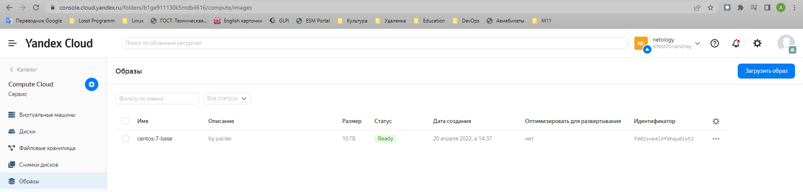
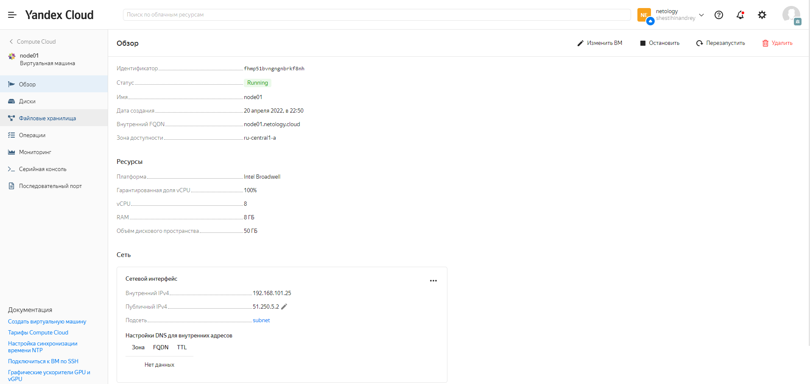

## Задача 1

Создать собственный образ операционной системы с помощью `Packer`.

  

___

## Задача 2

Создать вашу первую виртуальную машину в Яндекс.Облаке.

  

___

## Задача 3

Создать ваш первый готовый к боевой эксплуатации компонент мониторинга, состоящий из стека микросервисов.

  

