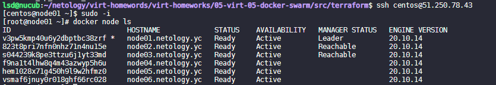
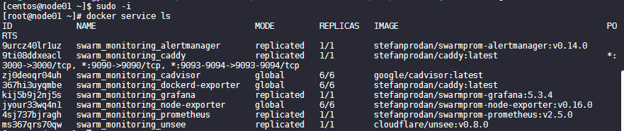
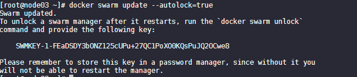
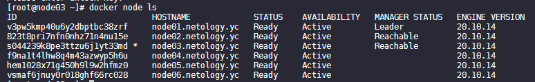

#  5.5. Оркестрация кластером Docker контейнеров на примере Docker Swarm

## Задача 1

Дайте письменые ответы на следующие вопросы:

- В чём отличие режимов работы сервисов в Docker Swarm кластере: replication и global?

В режиме replicated приложение запускается в том количестве экземпляров, какое укажет пользователь. 
При этом на отдельной ноде может быть как несколько экземпляров приложения, так и не быть совсем.

В режиме global приложение запускается обязательно на каждой ноде в единственном экземпляре.

- Какой алгоритм выбора лидера используется в Docker Swarm кластере?

Raft:

|:-------------------------------------:|
|Протокол решает проблему согласованности - чтобы все manager-ноды имели одинаковое представление о состоянии кластера|
|Для отказоустойчивой работы должно быть не менее трёх manager-нод|
|Количество нод обязательно должно быть нечётным, но лучше не более 7 (рекомендация из документации Docker)|
|Среди manager-нод выбирается лидер, его задача гарантировать согласованность|
|Лидер отправляет keepalive-пакеты с заданной периодичностью в пределах 150-300мс. Если пакеты не пришли, менеджеры начинают выборы нового лидера.|
|Если кластер разбит, нечётное количество нод должно гарантировать, что кластер останется консистентным, т.к. факт изменения состояния считается совершенным, если его отразило большинство нод. Если разбить кластер пополам, нечётное число гарантирует, что в какой-то части кластера будеть большинство нод.|
|:-------------------------------------:|

- Что такое Overlay Network?

L2 VPN сеть для связи демонов Docker между собой. В основе используется технология vxlan

## Задача 2

Создать ваш первый Docker Swarm кластер в Яндекс.Облаке

Для получения зачета, вам необходимо предоставить скриншот из терминала (консоли), с выводом команды:

```
docker node ls
```
<p align="left">
  
</p>

## Задача 3

Создать ваш первый, готовый к боевой эксплуатации кластер мониторинга, состоящий из стека микросервисов.

Для получения зачета, вам необходимо предоставить скриншот из терминала (консоли), с выводом команды:

```
docker service ls
```
<p align="left">
  
</p>

## Задача 4(*)

Выполнить на лидере Docker Swarm кластера команду (указанную ниже) и дать письменное описание её функционала, 
что она делает и зачем она нужна:

```
# см.документацию: https://docs.docker.com/engine/swarm/swarm_manager_locking/
docker swarm update --autolock=true
```
<p align="left">
  
</p>

<p align="left">
  
</p>

autolock=true - включить автоблокировку существующего роя

Чтобы отключить автоблокировку, установите --autolock=false. Взаимный ключ TLS и ключ шифрования, 
используемые для чтения и записи журналов Raft, хранятся на диске в незашифрованном виде. Существует компромисс 
между риском хранения ключа шифрования в незашифрованном виде и удобством перезапуска роя без необходимости 
разблокировать каждого менеджера.

Чтобы разблокировать заблокированный рой, используйте docker swarm unlock.

```
 docker swarm unlock
```

Введите ключ шифрования, который был сгенерирован и показан в выводе команды, когда вы заблокировали рой или поменяли ключ, 
и рой разблокируется.
