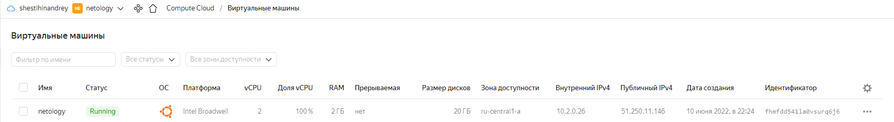

#  Домашнее задание к занятию "7.2. Облачные провайдеры и синтаксис Terraform."

Зачастую разбираться в новых инструментах гораздо интересней понимая то, как они работают изнутри. Поэтому в рамках первого необязательного задания предлагается завести свою учетную запись в AWS (Amazon Web Services) или Yandex.Cloud. Идеально будет познакомится с обоими облаками, потому что они отличаются.

#  Задача 1 (вариант с AWS). Регистрация в aws и знакомство с основами (необязательно, но крайне желательно).
Остальные задания можно будет выполнять и без этого аккаунта, но с ним можно будет увидеть полный цикл процессов.

AWS предоставляет достаточно много бесплатных ресурсов в первый год после регистрации, подробно описано здесь.

1. Создайте аккаут aws.
2. Установите c aws-cli https://aws.amazon.com/cli/.
3. Выполните первичную настройку aws-sli https://docs.aws.amazon.com/cli/latest/userguide/cli-configure-quickstart.html.
4. Создайте IAM политику для терраформа c правами
AmazonEC2FullAccess
AmazonS3FullAccess
AmazonDynamoDBFullAccess
AmazonRDSFullAccess
CloudWatchFullAccess
IAMFullAccess
5. Добавьте переменные окружения
export AWS_ACCESS_KEY_ID=(your access key id)
export AWS_SECRET_ACCESS_KEY=(your secret access key)
6. Создайте, остановите и удалите ec2 инстанс (любой с пометкой free tier) через веб интерфейс.
В виде результата задания приложите вывод команды aws configure list.

#  Задача 1 (Вариант с Yandex.Cloud). Регистрация в ЯО и знакомство с основами (необязательно, но крайне желательно).
1. Подробная инструкция на русском языке содержится здесь.
2. Обратите внимание на период бесплатного использования после регистрации аккаунта.
3. Используйте раздел "Подготовьте облако к работе" для регистрации аккаунта. Далее раздел "Настройте провайдер" для подготовки базового терраформ конфига.
4. Воспользуйтесь инструкцией на сайте терраформа, что бы не указывать авторизационный токен в коде, а терраформ провайдер брал его из переменных окружений.

```
lsd@nucub:~/terraform$ yc config list
token: xxxxxxxxxxxxxxxxxxxxxxx
cloud-id: b1g3va6uroak1bss6xxx
folder-id: b1ge911130k5mdbilxxx
compute-default-zone: ru-central1-a
```

#  Задача 2. Создание aws ec2 или yandex_compute_instance через терраформ.
1. В каталоге terraform вашего основного репозитория, который был создан в начале курсе, создайте файл main.tf и versions.tf.
2. Зарегистрируйте провайдер
- для aws. В файл main.tf добавьте блок provider, а в versions.tf блок terraform с вложенным блоком required_providers. Укажите любой выбранный вами регион внутри блока provider.
- либо для yandex.cloud. Подробную инструкцию можно найти здесь.
3. Внимание! В гит репозиторий нельзя пушить ваши личные ключи доступа к аккаунту. Поэтому в предыдущем задании мы указывали их в виде переменных окружения.
4. В файле main.tf воспользуйтесь блоком data "aws_ami для поиска ami образа последнего Ubuntu.
5. В файле main.tf создайте рессурс
- либо ec2 instance. Постарайтесь указать как можно больше параметров для его определения. Минимальный набор параметров указан в первом блоке Example Usage, но желательно, указать большее количество параметров.
- либо yandex_compute_image.
6. Также в случае использования aws:
- Добавьте data-блоки aws_caller_identity и aws_region.
- В файл outputs.tf поместить блоки output с данными об используемых в данный момент:
    - AWS account ID,
    - AWS user ID,
    - AWS регион, который используется в данный момент,
    - Приватный IP ec2 инстансы,
    - Идентификатор подсети в которой создан инстанс.
7. Если вы выполнили первый пункт, то добейтесь того, что бы команда terraform plan выполнялась без ошибок.
В качестве результата задания предоставьте:

```
lsd@nucub:~/terraform$ terraform plan
data.yandex_compute_image.ubuntu: Reading...
data.yandex_compute_image.ubuntu: Read complete after 1s [id=fd87tirk5i8vitv9uuo1]

Terraform used the selected providers to generate the following execution plan. Resource actions are indicated with the
following symbols:
  + create

Terraform will perform the following actions:

  # yandex_compute_instance.vm will be created
  + resource "yandex_compute_instance" "vm" {
      + created_at                = (known after apply)
      + folder_id                 = (known after apply)
      + fqdn                      = (known after apply)
      + hostname                  = "netology.local"
      + id                        = (known after apply)
      + metadata                  = {
          + "ssh-keys" = <<-EOT
                ubuntu:ssh-rsa AAAAB3NzaC1yc2EAAAADAQABAAABAQCfMZCwa9l/mw2dtG0AaKaRMA2SCFiC3V61e5rbYt4wWT7xI//9ymSyfUEdDxxv5VrJixTGe75xMCMdX6x8blVscuWttFnCxSzONnM8U6dH3YFbSn3GoVSUHvstKqljRA72+/wrnhHtLb/j8/d/M0lZH6X50H0ksaJBczUkoVaP4VGMy5YveczFZHrlgxkDCDoFukEEbjFpqy9PpXV92w8kBbEl3dQEFmi7sjJ89cUFHxqKKdv9pkXb/MaUDstPwqeHSchJJM/QR8mmEePVbYBglMgmDUb8KgNAoIactTvvWic8pk8V/s2UP4f7GleaSuqHE2Qip3R2+KxPVOI/ne3D lsd@nucub
            EOT
        }
      + name                      = "netology"
      + network_acceleration_type = "standard"
      + platform_id               = "standard-v1"
      + service_account_id        = (known after apply)
      + status                    = (known after apply)
      + zone                      = (known after apply)

      + boot_disk {
          + auto_delete = true
          + device_name = (known after apply)
          + disk_id     = (known after apply)
          + mode        = (known after apply)

          + initialize_params {
              + block_size  = (known after apply)
              + description = (known after apply)
              + image_id    = "fd87tirk5i8vitv9uuo1"
              + name        = (known after apply)
              + size        = 20
              + snapshot_id = (known after apply)
              + type        = "network-hdd"
            }
        }

      + network_interface {
          + index              = (known after apply)
          + ip_address         = (known after apply)
          + ipv4               = true
          + ipv6               = false
          + ipv6_address       = (known after apply)
          + mac_address        = (known after apply)
          + nat                = true
          + nat_ip_address     = (known after apply)
          + nat_ip_version     = (known after apply)
          + security_group_ids = (known after apply)
          + subnet_id          = (known after apply)
        }

      + placement_policy {
          + host_affinity_rules = (known after apply)
          + placement_group_id  = (known after apply)
        }

      + resources {
          + core_fraction = 100
          + cores         = 2
          + memory        = 2
        }

      + scheduling_policy {
          + preemptible = (known after apply)
        }
    }

  # yandex_vpc_network.net will be created
  + resource "yandex_vpc_network" "net" {
      + created_at                = (known after apply)
      + default_security_group_id = (known after apply)
      + folder_id                 = (known after apply)
      + id                        = (known after apply)
      + labels                    = (known after apply)
      + name                      = "net"
      + subnet_ids                = (known after apply)
    }

  # yandex_vpc_subnet.subnet will be created
  + resource "yandex_vpc_subnet" "subnet" {
      + created_at     = (known after apply)
      + folder_id      = (known after apply)
      + id             = (known after apply)
      + labels         = (known after apply)
      + name           = "subnet"
      + network_id     = (known after apply)
      + v4_cidr_blocks = [
          + "10.2.0.0/16",
        ]
      + v6_cidr_blocks = (known after apply)
      + zone           = "ru-central1-a"
    }

Plan: 3 to add, 0 to change, 0 to destroy.

Changes to Outputs:
  + yandex_ip_private = (known after apply)
  + yandex_vpc_subnet = (known after apply)
  + yandex_zone       = (known after apply)

───────────────────────────────────────────────────────────────────────────────────────────────────────────────────────────

Note: You didn't use the -out option to save this plan, so Terraform can't guarantee to take exactly these actions if you
run "terraform apply" now.
```

```
lsd@nucub:~/terraform$ terraform apply
data.yandex_compute_image.ubuntu: Reading...
yandex_vpc_network.net: Refreshing state... [id=enp4vmd3bqid6ieu8tig]
data.yandex_compute_image.ubuntu: Read complete after 1s [id=fd87tirk5i8vitv9uuo1]
yandex_vpc_subnet.subnet: Refreshing state... [id=e9b5qh3get3hdhp2e944]

Terraform used the selected providers to generate the following execution plan. Resource actions are indicated with the
following symbols:
  + create

Terraform will perform the following actions:

  # yandex_compute_instance.vm will be created
  + resource "yandex_compute_instance" "vm" {
      + created_at                = (known after apply)
      + folder_id                 = (known after apply)
      + fqdn                      = (known after apply)
      + hostname                  = "netology.local"
      + id                        = (known after apply)
      + metadata                  = {
          + "ssh-keys" = <<-EOT
                ubuntu:ssh-rsa AAAAB3NzaC1yc2EAAAADAQABAAABAQCfMZCwa9l/mw2dtG0AaKaRMA2SCFiC3V61e5rbYt4wWT7xI//9ymSyfUEdDxxv5VrJixTGe75xMCMdX6x8blVscuWttFnCxSzONnM8U6dH3YFbSn3GoVSUHvstKqljRA72+/wrnhHtLb/j8/d/M0lZH6X50H0ksaJBczUkoVaP4VGMy5YveczFZHrlgxkDCDoFukEEbjFpqy9PpXV92w8kBbEl3dQEFmi7sjJ89cUFHxqKKdv9pkXb/MaUDstPwqeHSchJJM/QR8mmEePVbYBglMgmDUb8KgNAoIactTvvWic8pk8V/s2UP4f7GleaSuqHE2Qip3R2+KxPVOI/ne3D lsd@nucub
            EOT
        }
      + name                      = "netology"
      + network_acceleration_type = "standard"
      + platform_id               = "standard-v1"
      + service_account_id        = (known after apply)
      + status                    = (known after apply)
      + zone                      = (known after apply)

      + boot_disk {
          + auto_delete = true
          + device_name = (known after apply)
          + disk_id     = (known after apply)
          + mode        = (known after apply)

          + initialize_params {
              + block_size  = (known after apply)
              + description = (known after apply)
              + image_id    = "fd87tirk5i8vitv9uuo1"
              + name        = (known after apply)
              + size        = 20
              + snapshot_id = (known after apply)
              + type        = "network-hdd"
            }
        }

      + network_interface {
          + index              = (known after apply)
          + ip_address         = (known after apply)
          + ipv4               = true
          + ipv6               = false
          + ipv6_address       = (known after apply)
          + mac_address        = (known after apply)
          + nat                = true
          + nat_ip_address     = (known after apply)
          + nat_ip_version     = (known after apply)
          + security_group_ids = (known after apply)
          + subnet_id          = "e9b5qh3get3hdhp2e944"
        }

      + placement_policy {
          + host_affinity_rules = (known after apply)
          + placement_group_id  = (known after apply)
        }

      + resources {
          + core_fraction = 100
          + cores         = 2
          + memory        = 2
        }

      + scheduling_policy {
          + preemptible = (known after apply)
        }
    }

Plan: 1 to add, 0 to change, 0 to destroy.

Changes to Outputs:
  + yandex_ip_private = (known after apply)
  + yandex_zone       = (known after apply)

Do you want to perform these actions?
  Terraform will perform the actions described above.
  Only 'yes' will be accepted to approve.

  Enter a value: yes

yandex_compute_instance.vm: Creating...
yandex_compute_instance.vm: Still creating... [10s elapsed]
yandex_compute_instance.vm: Still creating... [20s elapsed]
yandex_compute_instance.vm: Creation complete after 28s [id=fhmfdd541la0vsurq6j6]

Apply complete! Resources: 1 added, 0 changed, 0 destroyed.

Outputs:

yandex_ip_private = "10.2.0.26"
yandex_vpc_subnet = "e9b5qh3get3hdhp2e944"
yandex_zone = "ru-central1-a"
```
<p align="left">
  
</p>


Ответ на вопрос: при помощи какого инструмента (из разобранных на прошлом занятии) можно создать свой образ ami? [Packer](https://www.packer.io/)

Ссылку на репозиторий с [исходной конфигурацией терраформа](https://github.com/sisipka/devops-netology/tree/main/terraform)