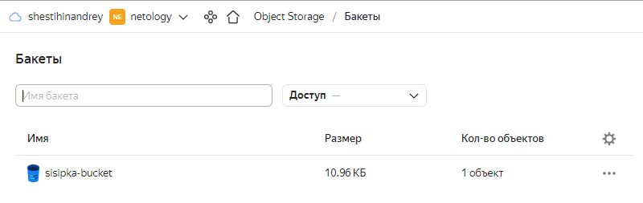
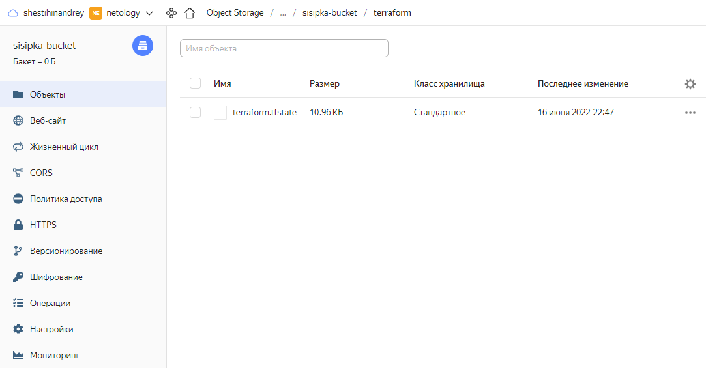
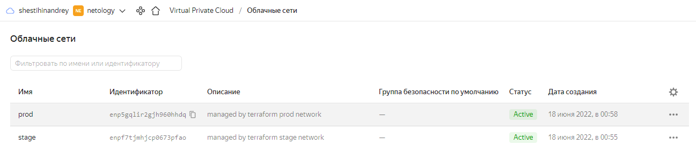

##   Задача 1. Создадим бэкэнд в S3 (необязательно, но крайне желательно).

Если в рамках предыдущего задания у вас уже есть аккаунт AWS, то давайте продолжим знакомство со взаимодействием терраформа и aws.

1. Создайте s3 бакет, iam роль и пользователя от которого будет работать терраформ. Можно создать отдельного пользователя, а можно использовать созданного в рамках предыдущего задания, просто добавьте ему необходимы права, как описано здесь.
2. Зарегистрируйте бэкэнд в терраформ проекте как описано по ссылке выше.

<p align="left">
  
</p>

<p align="left">
  
</p>

```bash
resource "yandex_iam_service_account" "sa" {
  folder_id = var.yandex_folder_id
  name      = "sa-sisipka"
}

resource "yandex_resourcemanager_folder_iam_member" "sa-sisipka" {
  folder_id = var.yandex_folder_id
  role      = "storage.editor"
  member    = "serviceAccount:${yandex_iam_service_account.sa.id}"
}

resource "yandex_iam_service_account_static_access_key" "sa-static-key" {
  service_account_id = yandex_iam_service_account.sa.id
  description        = "Static access key for object storage"
}

resource "yandex_storage_bucket" "state" {
  bucket     = "sisipka-bucket"
  access_key = yandex_iam_service_account_static_access_key.sa-static-key.access_key
  secret_key = yandex_iam_service_account_static_access_key.sa-static-key.secret_key
}
```

___

##  Задача 2. Инициализируем проект и создаем воркспейсы.

1. Выполните terraform init:
- если был создан бэкэнд в S3, то терраформ создат файл стейтов в S3 и запись в таблице dynamodb.
- иначе будет создан локальный файл со стейтами.
2. Создайте два воркспейса [stage и prod](https://github.com/sisipka/devops-netology/tree/main/7.3%20%D0%9E%D1%81%D0%BD%D0%BE%D0%B2%D1%8B%20%D0%B8%20%D0%BF%D1%80%D0%B8%D0%BD%D1%86%D0%B8%D0%BF%20%D1%80%D0%B0%D0%B1%D0%BE%D1%82%D1%8BTerraform).

```bash
lsd@nucub:~/ya_bucket$ terraform workspace list
* default
  prod
  stage
```
<p align="left">
  
</p>

3. В уже созданный aws_instance добавьте зависимость типа инстанса от вокспейса, что бы в разных ворскспейсах использовались разные instance_type.
4. Добавим count. Для stage должен создаться один экземпляр ec2, а для prod два.
5. Создайте рядом еще один aws_instance, но теперь определите их количество при помощи for_each, а не count.
6. Что бы при изменении типа инстанса не возникло ситуации, когда не будет ни одного инстанса добавьте параметр жизненного цикла create_before_destroy = true в один из рессурсов aws_instance.
7. При желании поэкспериментируйте с другими параметрами и рессурсами.

В виде результата работы пришлите:

- Вывод команды terraform workspace list.

```bash
lsd@nucub:~/fin$ terraform workspace list
  default
* prod
  stage
```

- Вывод команды `terraform plan` для воркспейса `prod`.

```bash
lsd@nucub:~/fin$ terraform plan
data.yandex_compute_image.ubuntu: Reading...
data.yandex_compute_image.ubuntu: Read complete after 1s [id=fd8mn5e1cksb3s1pcq12]

Terraform used the selected providers to generate the following execution plan. Resource actions are indicated
with the following symbols:
  + create

Terraform will perform the following actions:

  # yandex_compute_instance.vm[0] will be created
  + resource "yandex_compute_instance" "vm" {
      + created_at                = (known after apply)
      + folder_id                 = (known after apply)
      + fqdn                      = (known after apply)
      + hostname                  = (known after apply)
      + id                        = (known after apply)
      + metadata                  = {
          + "ssh-keys" = <<-EOT
                ubuntu:ssh-rsa AAAAB3NzaC1yc2EAAAADAQABAAABAQCfMZCwa9l/mw2dtG0AaKaRMA2SCFiC3V61e5rbYt4wWT7xI//9ymSyfUEdDxxv5VrJixTGe75xMCMdX6x8blVscuWttFnCxSzONnM8U6dH3YFbSn3GoVSUHvstKqljRA72+/wrnhHtLb/j8/d/M0lZH6X50H0ksaJBczUkoVaP4VGMy5YveczFZHrlgxkDCDoFukEEbjFpqy9PpXV92w8kBbEl3dQEFmi7sjJ89cUFHxqKKdv9pkXb/MaUDstPwqeHSchJJM/QR8mmEePVbYBglMgmDUb8KgNAoIactTvvWic8pk8V/s2UP4f7GleaSuqHE2Qip3R2+KxPVOI/ne3D lsd@nucub
            EOT
        }
      + network_acceleration_type = "standard"
      + platform_id               = "standard-v1"
      + service_account_id        = (known after apply)
      + status                    = (known after apply)
      + zone                      = (known after apply)

      + boot_disk {
          + auto_delete = true
          + device_name = (known after apply)
          + disk_id     = (known after apply)
          + mode        = (known after apply)

          + initialize_params {
              + block_size  = (known after apply)
              + description = (known after apply)
              + image_id    = "fd8mn5e1cksb3s1pcq12"
              + name        = (known after apply)
              + size        = 20
              + snapshot_id = (known after apply)
              + type        = "network-hdd"
            }
        }

      + network_interface {
          + index              = (known after apply)
          + ip_address         = (known after apply)
          + ipv4               = true
          + ipv6               = false
          + ipv6_address       = (known after apply)
          + mac_address        = (known after apply)
          + nat                = true
          + nat_ip_address     = (known after apply)
          + nat_ip_version     = (known after apply)
          + security_group_ids = (known after apply)
          + subnet_id          = (known after apply)
        }

      + placement_policy {
          + host_affinity_rules = (known after apply)
          + placement_group_id  = (known after apply)
        }

      + resources {
          + core_fraction = 100
          + cores         = 2
          + memory        = 2
        }

      + scheduling_policy {
          + preemptible = (known after apply)
        }
    }

  # yandex_compute_instance.vm[1] will be created
  + resource "yandex_compute_instance" "vm" {
      + created_at                = (known after apply)
      + folder_id                 = (known after apply)
      + fqdn                      = (known after apply)
      + hostname                  = (known after apply)
      + id                        = (known after apply)
      + metadata                  = {
          + "ssh-keys" = <<-EOT
                ubuntu:ssh-rsa AAAAB3NzaC1yc2EAAAADAQABAAABAQCfMZCwa9l/mw2dtG0AaKaRMA2SCFiC3V61e5rbYt4wWT7xI//9ymSyfUEdDxxv5VrJixTGe75xMCMdX6x8blVscuWttFnCxSzONnM8U6dH3YFbSn3GoVSUHvstKqljRA72+/wrnhHtLb/j8/d/M0lZH6X50H0ksaJBczUkoVaP4VGMy5YveczFZHrlgxkDCDoFukEEbjFpqy9PpXV92w8kBbEl3dQEFmi7sjJ89cUFHxqKKdv9pkXb/MaUDstPwqeHSchJJM/QR8mmEePVbYBglMgmDUb8KgNAoIactTvvWic8pk8V/s2UP4f7GleaSuqHE2Qip3R2+KxPVOI/ne3D lsd@nucub
            EOT
        }
      + network_acceleration_type = "standard"
      + platform_id               = "standard-v1"
      + service_account_id        = (known after apply)
      + status                    = (known after apply)
      + zone                      = (known after apply)

      + boot_disk {
          + auto_delete = true
          + device_name = (known after apply)
          + disk_id     = (known after apply)
          + mode        = (known after apply)

          + initialize_params {
              + block_size  = (known after apply)
              + description = (known after apply)
              + image_id    = "fd8mn5e1cksb3s1pcq12"
              + name        = (known after apply)
              + size        = 20
              + snapshot_id = (known after apply)
              + type        = "network-hdd"
            }
        }

      + network_interface {
          + index              = (known after apply)
          + ip_address         = (known after apply)
          + ipv4               = true
          + ipv6               = false
          + ipv6_address       = (known after apply)
          + mac_address        = (known after apply)
          + nat                = true
          + nat_ip_address     = (known after apply)
          + nat_ip_version     = (known after apply)
          + security_group_ids = (known after apply)
          + subnet_id          = (known after apply)
        }

      + placement_policy {
          + host_affinity_rules = (known after apply)
          + placement_group_id  = (known after apply)
        }

      + resources {
          + core_fraction = 100
          + cores         = 2
          + memory        = 2
        }

      + scheduling_policy {
          + preemptible = (known after apply)
        }
    }

  # yandex_compute_instance.vm1["node_1"] will be created
  + resource "yandex_compute_instance" "vm1" {
      + created_at                = (known after apply)
      + folder_id                 = (known after apply)
      + fqdn                      = (known after apply)
      + hostname                  = (known after apply)
      + id                        = (known after apply)
      + metadata                  = {
          + "ssh-keys" = <<-EOT
                ubuntu:ssh-rsa AAAAB3NzaC1yc2EAAAADAQABAAABAQCfMZCwa9l/mw2dtG0AaKaRMA2SCFiC3V61e5rbYt4wWT7xI//9ymSyfUEdDxxv5VrJixTGe75xMCMdX6x8blVscuWttFnCxSzONnM8U6dH3YFbSn3GoVSUHvstKqljRA72+/wrnhHtLb/j8/d/M0lZH6X50H0ksaJBczUkoVaP4VGMy5YveczFZHrlgxkDCDoFukEEbjFpqy9PpXV92w8kBbEl3dQEFmi7sjJ89cUFHxqKKdv9pkXb/MaUDstPwqeHSchJJM/QR8mmEePVbYBglMgmDUb8KgNAoIactTvvWic8pk8V/s2UP4f7GleaSuqHE2Qip3R2+KxPVOI/ne3D lsd@nucub
            EOT
        }
      + network_acceleration_type = "standard"
      + platform_id               = "standard-v1"
      + service_account_id        = (known after apply)
      + status                    = (known after apply)
      + zone                      = (known after apply)

      + boot_disk {
          + auto_delete = true
          + device_name = (known after apply)
          + disk_id     = (known after apply)
          + mode        = (known after apply)

          + initialize_params {
              + block_size  = (known after apply)
              + description = (known after apply)
              + image_id    = "fd8mn5e1cksb3s1pcq12"
              + name        = (known after apply)
              + size        = 20
              + snapshot_id = (known after apply)
              + type        = "network-hdd"
            }
        }

      + network_interface {
          + index              = (known after apply)
          + ip_address         = (known after apply)
          + ipv4               = true
          + ipv6               = false
          + ipv6_address       = (known after apply)
          + mac_address        = (known after apply)
          + nat                = true
          + nat_ip_address     = (known after apply)
          + nat_ip_version     = (known after apply)
          + security_group_ids = (known after apply)
          + subnet_id          = (known after apply)
        }

      + placement_policy {
          + host_affinity_rules = (known after apply)
          + placement_group_id  = (known after apply)
        }

      + resources {
          + core_fraction = 100
          + cores         = 2
          + memory        = 2
        }

      + scheduling_policy {
          + preemptible = (known after apply)
        }
    }

  # yandex_compute_instance.vm1["node_2"] will be created
  + resource "yandex_compute_instance" "vm1" {
      + created_at                = (known after apply)
      + folder_id                 = (known after apply)
      + fqdn                      = (known after apply)
      + hostname                  = (known after apply)
      + id                        = (known after apply)
      + metadata                  = {
          + "ssh-keys" = <<-EOT
                ubuntu:ssh-rsa AAAAB3NzaC1yc2EAAAADAQABAAABAQCfMZCwa9l/mw2dtG0AaKaRMA2SCFiC3V61e5rbYt4wWT7xI//9ymSyfUEdDxxv5VrJixTGe75xMCMdX6x8blVscuWttFnCxSzONnM8U6dH3YFbSn3GoVSUHvstKqljRA72+/wrnhHtLb/j8/d/M0lZH6X50H0ksaJBczUkoVaP4VGMy5YveczFZHrlgxkDCDoFukEEbjFpqy9PpXV92w8kBbEl3dQEFmi7sjJ89cUFHxqKKdv9pkXb/MaUDstPwqeHSchJJM/QR8mmEePVbYBglMgmDUb8KgNAoIactTvvWic8pk8V/s2UP4f7GleaSuqHE2Qip3R2+KxPVOI/ne3D lsd@nucub
            EOT
        }
      + network_acceleration_type = "standard"
      + platform_id               = "standard-v1"
      + service_account_id        = (known after apply)
      + status                    = (known after apply)
      + zone                      = (known after apply)

      + boot_disk {
          + auto_delete = true
          + device_name = (known after apply)
          + disk_id     = (known after apply)
          + mode        = (known after apply)

          + initialize_params {
              + block_size  = (known after apply)
              + description = (known after apply)
              + image_id    = "fd8mn5e1cksb3s1pcq12"
              + name        = (known after apply)
              + size        = 20
              + snapshot_id = (known after apply)
              + type        = "network-hdd"
            }
        }

      + network_interface {
          + index              = (known after apply)
          + ip_address         = (known after apply)
          + ipv4               = true
          + ipv6               = false
          + ipv6_address       = (known after apply)
          + mac_address        = (known after apply)
          + nat                = true
          + nat_ip_address     = (known after apply)
          + nat_ip_version     = (known after apply)
          + security_group_ids = (known after apply)
          + subnet_id          = (known after apply)
        }

      + placement_policy {
          + host_affinity_rules = (known after apply)
          + placement_group_id  = (known after apply)
        }

      + resources {
          + core_fraction = 100
          + cores         = 2
          + memory        = 2
        }

      + scheduling_policy {
          + preemptible = (known after apply)
        }
    }

  # yandex_vpc_network.net will be created
  + resource "yandex_vpc_network" "net" {
      + created_at                = (known after apply)
      + default_security_group_id = (known after apply)
      + folder_id                 = (known after apply)
      + id                        = (known after apply)
      + labels                    = (known after apply)
      + name                      = (known after apply)
      + subnet_ids                = (known after apply)
    }

  # yandex_vpc_subnet.subnet will be created
  + resource "yandex_vpc_subnet" "subnet" {
      + created_at     = (known after apply)
      + folder_id      = (known after apply)
      + id             = (known after apply)
      + labels         = (known after apply)
      + name           = (known after apply)
      + network_id     = (known after apply)
      + v4_cidr_blocks = [
          + "10.2.0.0/16",
        ]
      + v6_cidr_blocks = (known after apply)
      + zone           = "ru-central1-a"
    }

Plan: 6 to add, 0 to change, 0 to destroy.

────────────────────────────────────────────────────────────────────────────────────────────────────────────────

Note: You didn't use the -out option to save this plan, so Terraform can't guarantee to take exactly these
actions if you run "terraform apply" now.
```