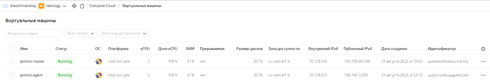
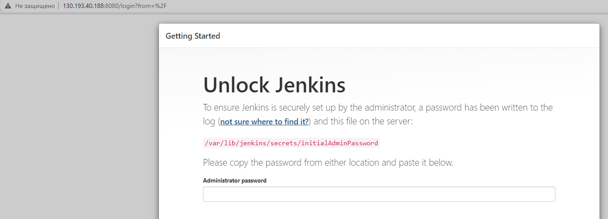
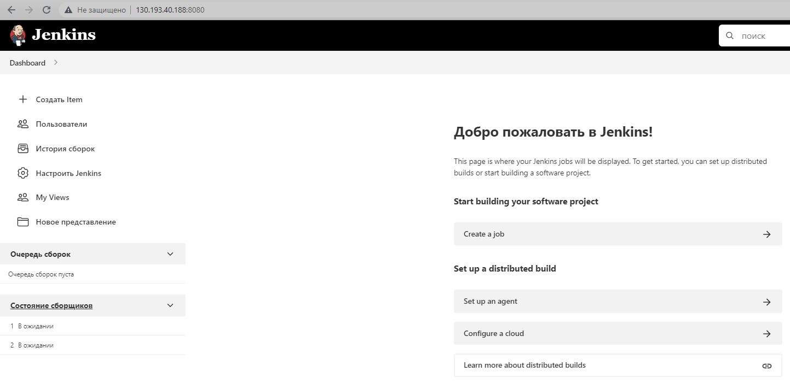
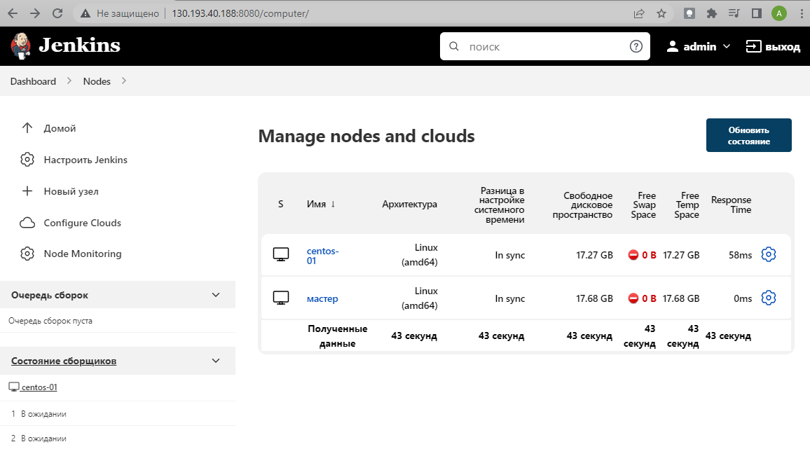
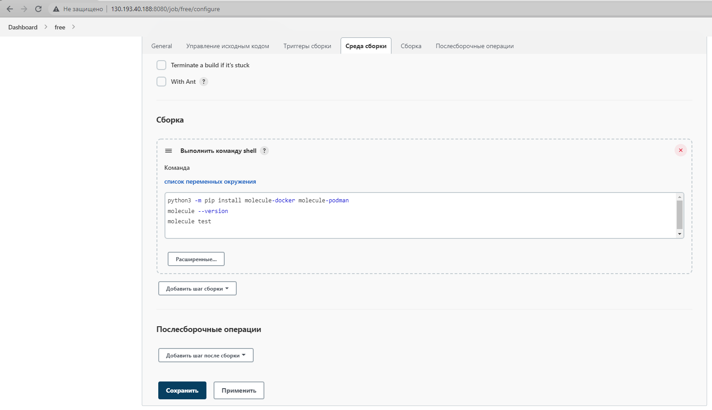
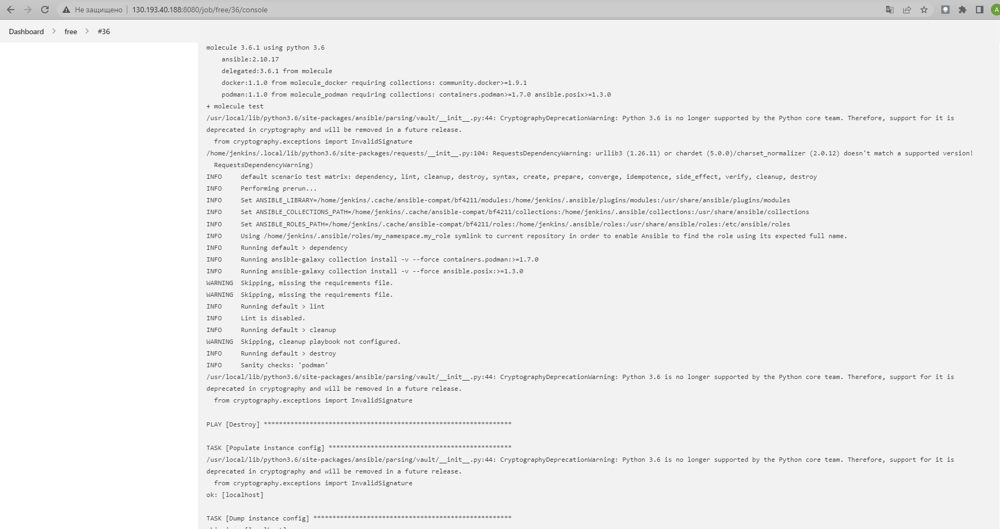
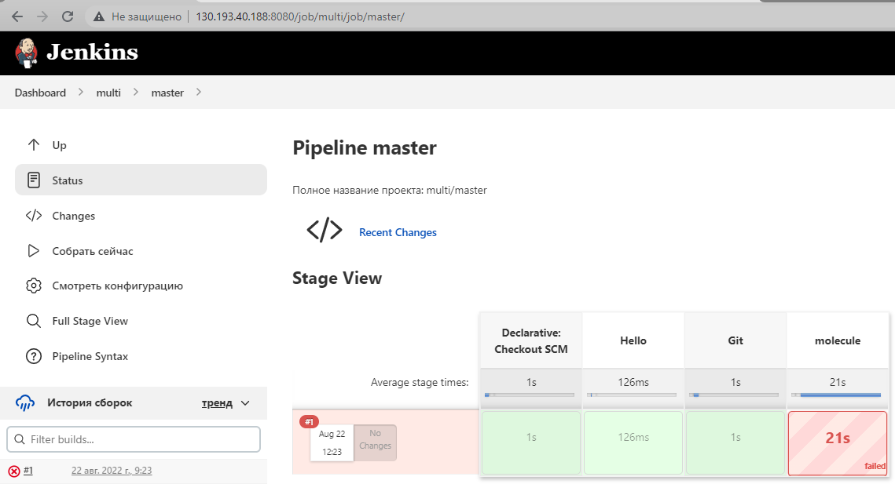
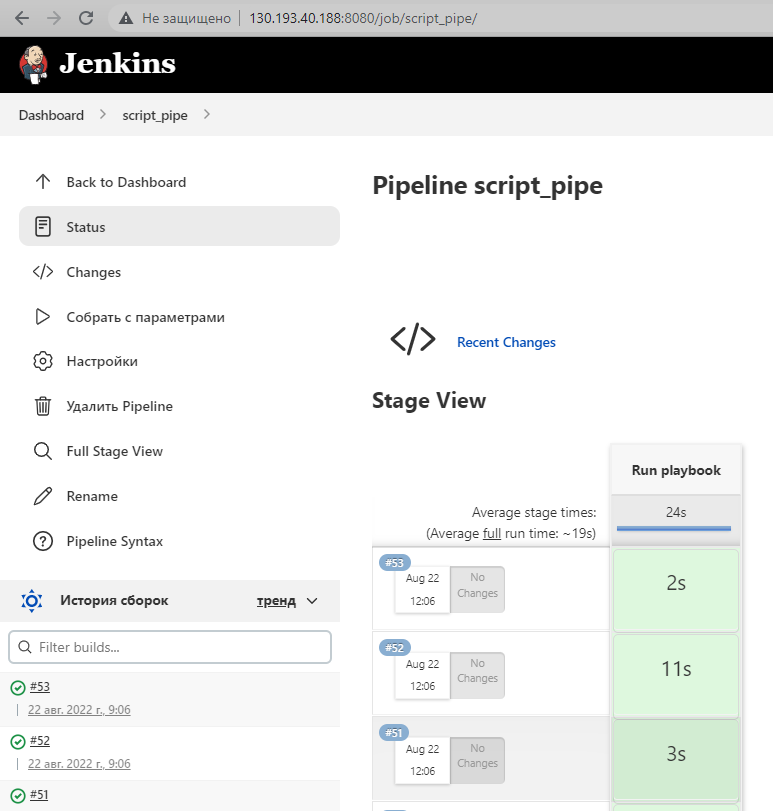

## Подготовка к выполнению

1. Создать 2 VM: для jenkins-master и jenkins-agent.

<p align="left">
  
</p>

2. Установить jenkins при помощи playbook'a.

```bash
PLAY RECAP *****************************************************************************************************************
jenkins-agent-01: ok=17   changed=14   unreachable=0    failed=0    skipped=0    rescued=0    ignored=0   
jenkins-master-01: ok=11   changed=9    unreachable=0    failed=0    skipped=0    rescued=0    ignored=0   
```

3. Запустить и проверить работоспособность.

<p align="left">
  
</p>

```bash
lsd@nucub:~/mnt-homeworks/09-ci-04-jenkins/infrastructure$ ssh 130.193.40.188
Warning: Permanently added '130.193.40.188' (ED25519) to the list of known hosts.
[lsd@jenkins-master ~]$ sudo cat /var/lib/jenkins/secrets/initialAdminPassword
8f055be38985423885d3b9a0106aa68f
```

4. Сделать первоначальную настройку.

<p align="left">
  
</p>

<p align="left">
  
</p>

## Основная часть

1. Сделать Freestyle Job, который будет запускать `molecule test` из любого вашего репозитория с ролью.

<p align="left">
  
</p>

<p align="left">
  
</p>

2. Сделать Declarative Pipeline Job, который будет запускать `molecule test` из любого вашего репозитория с ролью.

```yml
pipeline {
    agent {
        label 'centos-01'
    }

    stages {
        stage('Hello') {
            steps {
                echo 'Hello World'
            }
        }
        stage("Git") {
            steps {
                git branch: 'main', credentialsId: '900c5069-ee77-4065-be4c-33643aea1430', url: 'https://github.com/sisipka/vector-role.git'
            }
        }
        stage("molecule"){
            steps {
                sh '''pip install molecule-docker molecule-podman
molecule --version
molecule test'''
            }
        }
    }
}
```

3. Перенести Declarative Pipeline в репозиторий в файл `Jenkinsfile`.

https://github.com/sisipka/example-playbook/blob/master/Jenkinsfile

4. Создать Multibranch Pipeline на запуск `Jenkinsfile` из репозитория.

<p align="left">
  
</p>

5. Создать Scripted Pipeline, наполнить его скриптом из [pipeline](./pipeline).
6. Внести необходимые изменения, чтобы Pipeline запускал `ansible-playbook` без флагов `--check --diff`, если не установлен параметр при запуске джобы (prod_run = True), по умолчанию параметр имеет значение False и запускает прогон с флагами `--check --diff`.

```yml
node("centos-01"){
    if (env.PROD_RUN == "true") {
        stage("Run playbook") {
                git credentialsId: '900c5069-ee77-4065-be4c-33643aea1430', url: 'https://github.com/sisipka/example-playbook.git'
                sh 'ansible-playbook -i inventory/prod.yml site.yml'
        }
    }
    else {
        stage("Run playbook") {
                git credentialsId: '900c5069-ee77-4065-be4c-33643aea1430', url: 'https://github.com/sisipka/example-playbook.git'
                sh 'ansible-playbook -i inventory/prod.yml site.yml --check --diff'
        }
        
    }
}
```

7. Проверить работоспособность, исправить ошибки, исправленный Pipeline вложить в репозиторий в файл `ScriptedJenkinsfile`.

<p align="left">
  
</p>

8. Отправить ссылку на репозиторий с ролью и Declarative Pipeline и Scripted Pipeline.

https://github.com/sisipka/example-playbook

